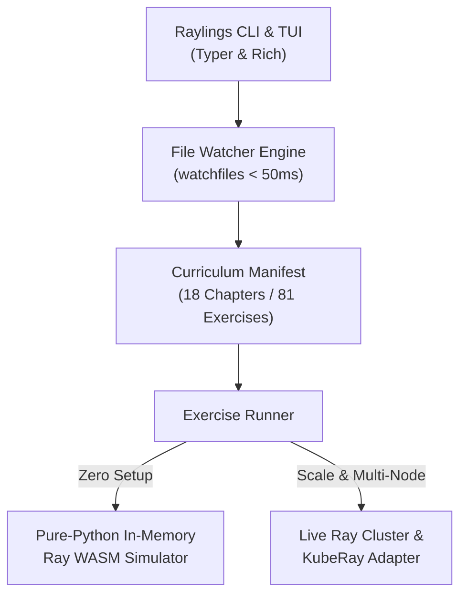

# Raylings ⚡

[](https://dnf0.github.io/raylings/)
[](https://marketplace.visualstudio.com/items?itemName=dnf0.raylings-vscode)
[](https://github.com/dnf0/raylings/actions)
[](https://github.com/dnf0/raylings/actions)
[](https://dnf0.github.io/raylings/playground/)
[](https://www.python.org/downloads/)
[](https://github.com/astral-sh/ruff)
[](https://github.com/microsoft/pyright)
[](LICENSE)

> **Master distributed AI, Ray Core actors, and scalable clusters from scratch through small, interactive, hands-on Python exercises.**

<p align="center">
  
</p>

Inspired by [rustlings](https://github.com/rust-lang/rustlings) and [ziglings](https://codeberg.org/ziglings/exercises), **Raylings** guides engineers through self-paced, hands-on micro-exercises. You will fix broken distributed tasks, construct stateful actor pools, eliminate object store bottlenecks, configure placement groups, build fault-tolerant streaming pipelines, coordinate PyTorch FSDP & DeepSpeed ZeRO training, serve LLMs with vLLM tensor parallelism, orchestrate KubeRay clusters on Kubernetes, and deploy quantitative risk analytics.

---

## Why Raylings?

- **Active Debugging & Iteration**: Every exercise starts broken or incomplete with `# TODO:` instructions and `# WHY:` architectural rationale. Edit the code until all verification checks pass.
- **Sub-50ms Watcher Loop**: Background file watcher evaluates changes instantly. Use single-key hotkeys (`r` rerun, `h` hint, `n` next, `p` prev, `l` list, `q` quit) to navigate seamlessly.
- **Dual Execution (Offline WASM & Live Cluster)**:
  - **In-Memory WebAssembly Simulator**: Zero cluster setup required. Practice directly in your terminal or browser via client-side Pyodide WebAssembly.
  - **Live Cluster & KubeRay Adapter**: Connect seamlessly to a local Ray session, remote cluster, or multi-node Kubernetes KubeRay deployment (`ray://localhost:10001`).
- **Progressive Multi-Tier Hints**: Reveal layered hints on demand (`raylings hint <exercise>`) without spoiling the solution.

---

## Architecture



> **Diagram Walkthrough & Core Concepts:**
> - **Interaction Layer**: The CLI and full-screen TUI provide interactive exercise evaluation, progress tracking, and cluster telemetry overlays.
> - **Execution Layer**: The Exercise Runner executes user code against isolated environments and streams assertion results back to the terminal in milliseconds.
> - **Runtime Layer**: Seamlessly switch between the pure-Python in-memory simulator (ideal for browser and offline practice) and real multi-node Ray/KubeRay clusters.

---

## Quickstart & Installation

### ⚡ Try in Browser (Zero Install)

Run Raylings directly in your browser with Monaco Editor and in-memory WebAssembly:
👉 **[Open Interactive WebAssembly Playground](https://dnf0.github.io/raylings/playground/)**

### 🚀 Instant Run (No Clone Needed)

Run Raylings instantly with [`uvx`](https://docs.astral.sh/uv/) or [`pipx`](https://pipx.pypa.io/):

```bash
# Launch the 5-step guided onboarding tour
uvx raylings tour

# Run preflight system & cluster diagnostics
uvx raylings doctor

# Initialize exercises in your current workspace
uvx raylings init

# Start the interactive background watcher
uvx raylings watch

# Or launch the full-screen split-pane TUI
uvx raylings tui
```

### 💻 Local Development Setup

```bash
git clone https://github.com/dnf0/raylings.git
cd raylings
uv venv && source .venv/bin/activate
uv pip install -e ".[dev]"

# Verify installation
raylings --help
```

---

## CLI & TUI Command Reference

### Core Commands

| Command | Usage | Description |
| :--- | :--- | :--- |
| `tour` | `raylings tour` | Launch interactive 5-step onboarding walkthrough. |
| `doctor` | `raylings doctor [--json]` | Run preflight diagnostics on Python, Ray runtime, and memory. |
| `init` | `raylings init` | Scaffold exercises and curriculum files in current folder. |
| `watch` | `raylings watch` | Start real-time file watcher with hotkey navigation. |
| `tui` | `raylings tui` | Launch full-screen interactive split-pane terminal UI. |
| `daemon` | `raylings daemon [start\|stop\|status\|restart]` | Manage persistent background Python Ray cluster session. |
| `top` | `raylings top [--interval 0.5]` | Live monitor of Plasma memory, spill rates, CPU/GPU, and actors. |
| `run` | `raylings run <exercise>` | Execute and evaluate a single exercise. |
| `hint` | `raylings hint <exercise>` | Display progressive multi-tiered hints for an exercise. |
| `list` | `raylings list` | View complete curriculum table and pass/fail status. |
| `progress` | `raylings progress` | Display completion progress bars and summary statistics. |
| `test` | `raylings test [--all]` | Verify all 81 canonical reference solutions. |
| `new` | `raylings new <chapter> <name>` | Scaffold new exercise and solution template. |
| `plugins` | `raylings plugins [list\|info\|validate]` | Manage external domain-specific curriculum packs. |

### Watcher & TUI Hotkeys

| Hotkey | Action |
| :---: | :--- |
| `r` / `Enter` | Rerun active exercise |
| `h` | Reveal next hint tier |
| `n` / `↓` / `j` | Advance to next exercise |
| `p` / `↑` / `k` | Return to previous exercise |
| `t` | Toggle live Ray cluster telemetry overlay (TUI) |
| `d` | Toggle preflight diagnostics overlay (TUI) |
| `l` | List all curriculum exercises |
| `q` | Quit watcher or TUI |

---

## VS Code & Cursor Extension 💻

Transform your editor into an integrated distributed computing learning IDE:

- 📚 **Activity Bar Curriculum Tree**: Browse all 18 chapters and 81 exercises with live pass/fail status badges.
- ⚡ **On-Save Live Diagnostics**: Automatic background validation with inline problem markers on save.
- 💡 **Quick Fixes & Progressive Hints**: Lightbulb actions to reveal progressive clues or open side-by-side solution diffs.
- 📊 **Status Bar Tracker**: Real-time completion percentage and 1-click jump to active exercise.

**Install via VS Code / Cursor Marketplace:**
```bash
code --install-extension dnf0.raylings-vscode
# Or for Cursor:
cursor --install-extension dnf0.raylings-vscode
```

---

## Curriculum & Syllabus

Raylings features **18 chapters** and **81 hands-on exercises**, each paired with a comprehensive online architectural guide:

| Chapter | Guide & Topic | Key Concepts | Exercises |
| :---: | :--- | :--- | :---: |
| **01** | [**Remote Tasks & Futures**](https://dnf0.github.io/raylings/guides/01-tasks/) | `ray.init()`, `@ray.remote` tasks, `ObjectRef`, parallel task graphs, non-blocking `ray.wait()` | `basics01`–`06` (6) |
| **02** | [**Stateful Actors & Concurrency**](https://dnf0.github.io/raylings/guides/02-actors/) | Actor classes, handles, async actors, threaded actors, detached actors, dynamic actor pools | `actors01`–`07` (7) |
| **03** | [**Plasma Object Store**](https://dnf0.github.io/raylings/guides/03-object-store/) | Shared memory, zero-copy NumPy/PyArrow transfers, `ray.put()`, pinning, disk spilling | `object_store01`–`06` (6) |
| **04** | [**Scheduling & Resources**](https://dnf0.github.io/raylings/guides/04-resources-scheduling/) | CPU/GPU fractions, custom resource tags, node affinity, `STRICT_SPREAD`, `STRICT_PACK` | `scheduling01`–`06` (6) |
| **05** | [**Lineage & Fault Tolerance**](https://dnf0.github.io/raylings/guides/05-fault-tolerance/) | Task retries (`max_retries`), actor restarts (`max_restarts`), lineage reconstruction, spot preemption | `fault01`–`04` (4) |
| **06** | [**Cluster Architecture & GCS**](https://dnf0.github.io/raylings/guides/06-cluster-architecture/) | Head vs worker node roles, Global Control Store (GCS), Raylet schedulers, Job Submission API | `cluster01`–`04` (4) |
| **07** | [**Patterns & Anti-Patterns**](https://dnf0.github.io/raylings/guides/07-patterns-and-antipatterns/) | Eliminating nested `ray.get()` blocking, task batching, actor bottlenecks, tree aggregations | `antipattern01`–`04` (4) |
| **08** | [**Streaming Ray Data**](https://dnf0.github.io/raylings/guides/08-ray-data/) | Ray Datasets, partitioning, `map_batches` (NumPy/PyArrow), `ActorPoolStrategy`, backpressure | `data01`–`05` (5) |
| **09** | [**Distributed ML from Scratch**](https://dnf0.github.io/raylings/guides/09-distributed-ml/) | Parameter servers, async/sync gradient updates, ring all-reduce, linear regression from scratch | `ml_scratch01`–`04` (4) |
| **10** | [**Distributed PyTorch (Ray Train)**](https://dnf0.github.io/raylings/guides/10-ray-train/) | `TorchTrainer`, `ScalingConfig`, distributed dataloaders, multi-worker gradient sync, checkpointing | `train01`–`04` (4) |
| **11** | [**Hyperparameter Search (Ray Tune)**](https://dnf0.github.io/raylings/guides/11-ray-tune/) | Hyperparameter spaces, distributed trial execution, ASHA early stopping, Population-Based Training | `tune01`–`03` (3) |
| **12** | [**Model Serving (Ray Serve)**](https://dnf0.github.io/raylings/guides/12-ray-serve/) | `@serve.deployment`, HTTP ingress handlers, dynamic request batching (`@serve.batch`), DAG pipelines | `serve01`–`05` (5) |
| **13** | [**Observability, Tracing & Profiling**](https://dnf0.github.io/raylings/guides/13-observability/) | Chrome execution timelines (`ray timeline`), memory profiling (`ray memory`), Prometheus metrics | `perf01`–`03` (3) |
| **14** | [**Kubernetes AI with KubeRay**](https://dnf0.github.io/raylings/guides/14-kuberay/) | RayCluster CRDs, RayJob batch lifecycles, RayService zero-downtime serving, KEDA autoscaling | `kuberay01`–`05` (5) |
| **15** | [**High-Throughput vLLM Serving**](https://dnf0.github.io/raylings/guides/15-vllm-and-llms/) | Tensor parallel weight sharding, PagedAttention KV cache, dynamic multi-LoRA adapters | `vllm01`–`04` (4) |
| **16** | [**Multi-Node LLM Training (FSDP)**](https://dnf0.github.io/raylings/guides/16-fsdp-deepspeed/) | PyTorch FSDP `ScalingConfig`, DeepSpeed ZeRO-1/2/3 partitioning, activation checkpointing | `fsdp01`–`04` (4) |
| **17** | [**Multimodal Embeddings & Vector RAG**](https://dnf0.github.io/raylings/guides/17-multimodal-vectors/) | Streaming image/audio ETL, GPU batch embeddings, dynamic sequence bucketing, vector DB ingestion | `data_genai01`–`04` (4) |
| **18** | [**Quantitative Finance Risk Engines**](https://dnf0.github.io/raylings/guides/18-quant-finance/) | Monte Carlo Black-Scholes option pricing, Value at Risk (VaR/CVaR), streaming market tick VWAP | `finance01`–`03` (3) |

---

## 🌐 The *lings Ecosystem

If you enjoy terminal-driven micro-learning, explore the other interactive platforms in our `*lings` suite:

- ☸️ [**Kubelings**](https://github.com/dnf0/kubelings) – Master Kubernetes from scratch through interactive YAML manifests, operators, sidecars, and cluster incident drills.
- 🏗️ [**Terralings**](https://github.com/dnf0/terralings) – Master Terraform and OpenTofu through interactive infrastructure-as-code exercises.
- 🇪🇸 [**Spanglings**](https://github.com/dnf0/spanglings) – Developer-grade CLI & interactive TUI for learning intermediate-to-advanced Spanish (B1–C1).
- ⚡ [**Raylings**](https://github.com/dnf0/raylings) – Master distributed AI, Ray Core actors, and scalable clusters through hands-on Python exercises.

---

## Contributing & Development

We welcome new exercises, bug fixes, and documentation improvements! Please check out [CONTRIBUTING.md](CONTRIBUTING.md) for local setup, exercise authoring standards, and test instructions.

---

## License

Raylings is distributed under the terms of the [Apache-2.0](LICENSE) license.
