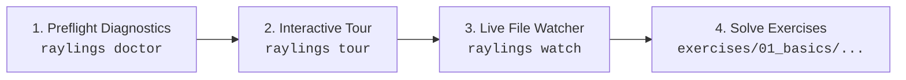
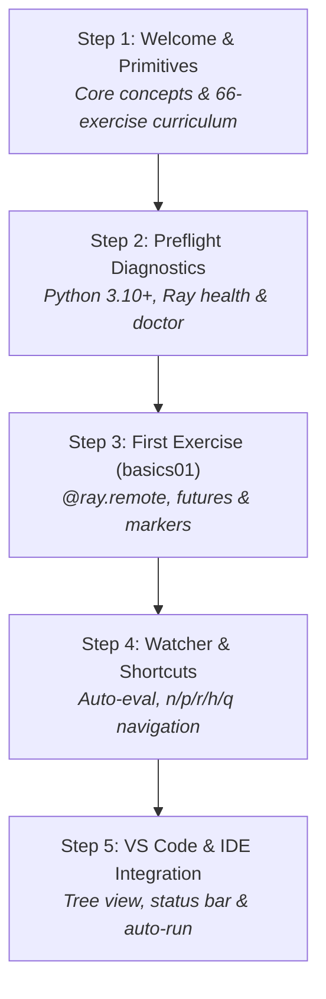

# Raylings Onboarding & Learner Guide ⚡

Welcome to **Raylings**! This guide is designed to get you up and running with Raylings quickly, whether you are taking your first steps with Python Ray or building production-grade distributed AI systems.

---

## Table of Contents

1. [🚀 Quickstart & First Steps](#-quickstart--first-steps)
2. [🔍 Preflight Diagnostics (`raylings doctor`)](#-preflight-diagnostics-raylings-doctor)
3. [🧭 Interactive CLI Tour (`raylings tour`)](#-interactive-cli-tour-raylings-tour)
4. [⚡ Continuous Watcher Mode & Workflow](#-continuous-watcher-mode--workflow)
5. [💻 VS Code Extension & Walkthrough](#-vs-code-extension--walkthrough)
6. [🗺️ Curriculum Progression & Learning Path](#️-curriculum-progression--learning-path)
7. [🛠️ Troubleshooting & FAQ](#️-troubleshooting--faq)

---

## 🚀 Quickstart & First Steps

Raylings offers multiple flexible installation methods depending on your development setup.

### Prerequisites

- **Python**: 3.10, 3.11, or 3.12
- **Operating System**: macOS, Linux, or Windows (WSL recommended for Windows)
- **Package Manager**: [uv](https://github.com/astral-sh/uv) (recommended) or `pipx` / `pip`

---

### Installation Options

#### Option A: Instant Run with `uvx` (No installation needed)

Initialize a workspace in any directory and launch the onboarding experience immediately:

```bash
uvx raylings init
uvx raylings doctor
uvx raylings tour
uvx raylings watch
```

#### Option B: Global Install with `pipx`

```bash
pipx install raylings
raylings init
raylings doctor
raylings tour
raylings watch
```

#### Option C: Standard Python Virtual Environment

```bash
pip install raylings
raylings init
raylings watch
```

#### Option D: From Source (Development / Contributing)

```bash
git clone https://github.com/dnf0/raylings.git
cd raylings
uv venv --python 3.11
source .venv/bin/activate
uv pip install -e ".[dev]"
raylings watch
```

---

### Recommended 3-Step First-Time Workflow



1. **Verify Your Environment**: Run `raylings doctor` to confirm Python 3.10+, Ray installation, resource capacity, and exercise manifests.
2. **Take the Guided Tour**: Run `raylings tour` to understand core Ray primitives, exercise structure, and keystroke shortcuts.
3. **Start the Live Watcher**: Run `raylings watch` and begin solving exercises in your favorite editor.

---

## 🔍 Preflight Diagnostics (`raylings doctor`)

Before tackling distributed exercises, verify that your machine meets all runtime requirements using the built-in diagnostic suite.

```bash
raylings doctor
```

### What `raylings doctor` Checks

| Diagnostic Check | Requirement | Purpose / Details | Severity |
| :--- | :--- | :--- | :--- |
| **Python Version** | Python `>= 3.10` (`< 3.13`) | Ray core and ML libraries require Python 3.10-3.12. | **Critical** |
| **Ray Installation** | Ray installed & importable | Verifies `import ray` succeeds and reports installed Ray version. | **Critical** |
| **Ray Daemon / Cluster** | Local cluster status | Inspects whether the background Ray daemon is active, reporting node count and GCS address. | Info / Warn |
| **Exercises Manifest** | `exercises/` directory | Validates that all 66+ curriculum exercises across 14 chapters are present and readable. | Warn |
| **System Resources** | CPU cores & RAM | Checks CPU core count (2+ cores recommended for concurrent actor/task scheduling) and physical RAM (>= 4 GB recommended). | Warn |

### Example CLI Output

```
┌──────────────────────────── Preflight Diagnostics Summary ────────────────────────────┐
│ Diagnostic Check           │   Status   │ Details                                     │
├────────────────────────────┼────────────┼─────────────────────────────────────────────┤
│ Python Version             │   ✓ PASS   │ Python 3.11.8 (>= 3.10 supported)           │
│ Ray Installation           │   ✓ PASS   │ Ray v2.35.0 installed and importable        │
│ Ray Daemon / Cluster       │   ✓ PASS   │ Cluster session active (Nodes: 1, GCS: Local)│
│ Exercises Manifest         │   ✓ PASS   │ Found 66 exercises across 14 chapters in ex │
│ System Resources           │   ✓ PASS   │ 10 logical CPUs (Darwin arm64, 32.0 GB RAM) │
└────────────────────────────┴────────────┴─────────────────────────────────────────────┘

Summary: 5 passed, 0 warnings, 0 failed
```

### JSON Export for CI and Tooling

For automated environments, CI pipelines, or IDE extensions, use the `--json` flag:

```bash
raylings doctor --json
```

```json
{
  "status": "healthy",
  "passed": true,
  "summary": {
    "total": 5,
    "passed": 5,
    "warnings": 0,
    "failed": 0
  },
  "checks": [
    {
      "name": "Python Version",
      "status": "pass",
      "critical": true,
      "details": "Python 3.11.8 (>= 3.10 supported)"
    }
  ]
}
```

> [!NOTE]
> If any **critical** diagnostic check fails, `raylings doctor` exits with a non-zero exit code (`1`), immediately flagging blocking issues.

---

## 🧭 Interactive CLI Tour (`raylings tour`)

The interactive onboarding tour guides you through the curriculum, distributed concepts, and developer workflows in 5 structured steps.

```bash
raylings tour
```

### Tour Curriculum (5 Steps)



1. **Step 1 — Welcome to Raylings & Distributed Ray Primitives**: Overview of distributed execution, tasks, actors, placement groups, Ray Data, Ray Train, and Ray Serve.
2. **Step 2 — Environment & Preflight Diagnostics**: Verifying runtime dependencies, hardware requirements, and Ray cluster health with `raylings doctor`.
3. **Step 3 — Solving Your First Exercise (`basics01`)**: Detailed walkthrough on using `@ray.remote`, `.remote()`, `ray.get()`, and resolving the `# I AM NOT DONE` marker.
4. **Step 4 — Watcher & Keystroke Navigation**: Learning continuous test-driven workflows and keystroke navigation shortcuts.
5. **Step 5 — VS Code & IDE Experience**: Exploring the native VS Code extension, sidebar tree view, status bar progress, and automated on-save evaluation.

### Tour CLI Flags

- **Interactive Mode** (default):
  ```bash
  raylings tour
  ```
  Advances step-by-step when you press `Enter`. Type `q` at any prompt to exit.

- **Jump to a Specific Step** (`--step` / `-s`):
  ```bash
  raylings tour --step 3
  ```
  Directly renders Step 3 without stepping through earlier steps.

- **Non-Interactive Batch Mode** (`--non-interactive` / `-y`):
  ```bash
  raylings tour -y
  ```
  Dumps all 5 steps sequentially without waiting for keyboard inputs. Ideal for scripts or piping to a pager.

- **JSON Output** (`--json`):
  ```bash
  raylings tour --json
  ```
  Exports full tour metadata and step content as structured JSON.

---

## ⚡ Continuous Watcher Mode & Workflow

The heart of the Raylings learning experience is the continuous file watcher.

```bash
raylings watch
```

```
       ____             ___             
      / __ \____ ___  __/ (_)___  ____ _
     / /_/ / __ `/ / / / / / __ \/ __ `/
    / _, _/ /_/ / /_/ / / / / / / /_/ / 
   /_/ |_|\__,_/\__, /_/_/_/ /_/\__, /  
               /____/          /____/   
   Master Distributed Python & AI Systems

Progress: [==============>------------------------------------------] 25.0% (16/66)

Current Exercise: exercises/01_basics/basics01.py
Status: ❌ FAILED (I AM NOT DONE marker present)
```

### The Learning Loop

1. **Edit**: Open the indicated exercise file (e.g. `exercises/01_basics/basics01.py`) in your code editor.
2. **Implement**: Read the instructions and docstring. Replace placeholder code with valid Ray distributed calls.
3. **Remove Marker**: Remove the `# I AM NOT DONE` comment at the top of the file.
4. **Save**: Save the file (`Ctrl+S` / `Cmd+S`).
5. **Instant Validation**: Raylings immediately executes the exercise against the warm background Ray cluster and reports results.
6. **Advance**: When tests pass, Raylings automatically records progress and transitions to the next exercise!

### Interactive Keyboard Shortcuts

While `raylings watch` is running, use these single-key shortcuts in your terminal:

| Key | Action | Description |
| :---: | :--- | :--- |
| <kbd>n</kbd> | **Next Exercise** | Manually skips forward to the next exercise in the curriculum. |
| <kbd>p</kbd> | **Previous Exercise** | Navigates back to the previous exercise to review or re-attempt. |
| <kbd>r</kbd> | **Rerun Current** | Force-reruns the current exercise immediately without modifying the file. |
| <kbd>h</kbd> | **Reveal Hint** | Displays progressive, multi-tiered hints (Level 1 $\rightarrow$ Level 2 $\rightarrow$ Solution hint). |
| <kbd>q</kbd> | **Quit Watcher** | Gracefully shuts down the watcher and background listeners. |

### Progressive Hints System

If you find yourself stuck, request layered hints without having the full solution spoiled:

```bash
# In another terminal or via CLI:
raylings hint basics01          # Displays Hint Level 1
raylings hint basics01 --level 1 # Displays Hint Level 2
```

---

## 💻 VS Code Extension & Walkthrough

Raylings includes a first-class extension for VS Code and Cursor (`editors/vscode`).

### Key Extension Features

- 🌟 **Interactive Getting Started Walkthrough (`raylings.welcome`)**: Built-in 5-step interactive onboarding guide accessible via **Help > Welcome > Walkthroughs > Welcome to Raylings**.
- 🌲 **Curriculum Activity Bar Explorer (`raylings-explorer`)**: Browse all 14 chapters in a dedicated sidebar tree view, complete with completion badges (✅ passed, ⏳ pending).
- 💾 **Auto-run on Save (`raylings.autoRunOnSave`)**: Automatically validates the current exercise whenever you save a Python file in `exercises/`.
- 📊 **Status Bar Integration**: Displays current exercise name and total curriculum progress percentage in the lower status bar.
- 💡 **One-Click Commands**:
  - `Raylings: Start Onboarding Tour`
  - `Raylings: Run Preflight Diagnostics (Doctor)`
  - `Raylings: Run Current Exercise`
  - `Raylings: Show Exercise Hint`
  - `Raylings: View Reference Solution`
  - `Raylings: Start Watcher in Terminal`

### Extension Configuration Settings

Configure extension preferences in your `settings.json`:

```json
{
  "raylings.executablePath": "raylings",
  "raylings.autoRunOnSave": true,
  "raylings.showStatusBar": true
}
```

---

## 🗺️ Curriculum Progression & Learning Path

The Raylings curriculum consists of 14 chapters and 66 hands-on exercises spanning basic distributed primitives to production ML systems:

```text
Chapter 01: Ray Core Foundations (basics01 - basics06)
 ├── ray.init(), @ray.remote tasks, ObjectRef futures
 └── Parallel pipelines, ray.wait(), dynamic fan-out

Chapter 02: Distributed State & Actors (actors01 - actors07)
 ├── Stateful Actor classes, method serialization, handles
 └── Async actors, threaded actors, detached actors, actor pools

Chapter 03: Plasma Object Store & Zero-Copy (object_store01 - object_store06)
 ├── Shared memory architecture, zero-copy NumPy/PyArrow
 └── ray.put(), object pinning, disk spilling, serialization closures

Chapter 04: Scheduling & Placement Groups (scheduling01 - scheduling06)
 ├── Fractional CPU/GPU resources, node affinity
 └── STRICT_SPREAD, STRICT_PACK, multi-bundle gang scheduling

Chapter 05: Fault Tolerance & Recovery (fault01 - fault04)
 ├── Automatic task retries, max_restarts, lineage reconstruction
 └── Spot instance preemption handling & object recovery

Chapter 06: Cluster Architecture & Simulation (cluster01 - cluster04)
 ├── Head vs worker nodes, Global Control Store (GCS), Raylets
 └── Multi-node simulation with Cluster API, Job Submission

Chapter 07: Distributed Patterns & Anti-Patterns (antipattern01 - antipattern04)
 ├── Eliminating nested ray.get() anti-patterns
 └── Task chunking/batching, actor bottleneck resolution, tree reduction

Chapter 08: Ray Data (data01 - data05)
 ├── Distributed Datasets, block partitioning, map_batches
 └── PyArrow/NumPy streaming, ActorPoolStrategy, backpressure

Chapter 09: Distributed ML Primitives from Scratch (ml_scratch01 - ml_scratch04)
 ├── Distributed Parameter Servers (Sync & Async SGD)
 └── Ring All-Reduce communication primitives, distributed trainers

Chapter 10: Ray Train (train01 - train04)
 ├── TorchTrainer, ScalingConfig (multi-worker / multi-GPU)
 └── Distributed dataloaders, gradient sync, distributed checkpointing

Chapter 11: Ray Tune (tune01 - tune03)
 ├── Hyperparameter search spaces, distributed trial execution
 └── ASHA / HyperBand early stopping, Population-Based Training (PBT)

Chapter 12: Ray Serve (serve01 - serve06)
 ├── @serve.deployment, HTTP ingress, dynamic batching (@serve.batch)
 └── Multi-model deployment DAGs, streaming LLM responses, autoscaling

Chapter 13: Observability & Distributed Debugging (perf01 - perf03)
 ├── Chrome execution timelines (ray timeline), ray memory profiling
 └── Prometheus metrics export, GCS state dumps & logging

Chapter 14: KubeRay & Production Kubernetes (kuberay01 - kuberay05)
 ├── RayCluster Custom Resource Definition (CRD) manifests
 └── RayJob batch lifecycles, RayService zero-downtime upgrades, KEDA
```

---

## 🛠️ Troubleshooting & FAQ

### Ray Daemon Issues

**Symptom**: `raylings watch` or `raylings run` hangs or fails with connection errors to the Ray cluster.

**Resolution**:
1. Check daemon status:
   ```bash
   raylings daemon status
   ```
2. Restart the daemon to reset state:
   ```bash
   raylings daemon restart
   ```
3. If an orphaned Ray session is lingering on your machine, force-stop it:
   ```bash
   ray stop --force
   ```

---

### Port Conflicts (GCS / Redis / Dashboard)

**Symptom**: `ray.init()` fails with `Address already in use` (e.g. port 6379, 10001, or 8265).

**Resolution**:
- Another Ray session or local service is bound to standard Ray ports.
- Run `raylings doctor` to inspect active Ray daemon sessions.
- Run `ray stop --force` to terminate leftover Ray processes.

---

### Resource & Memory Limits (Plasma Store OutOfMemory)

**Symptom**: Tasks or Plasma object store fail with `ObjectStoreFullError` or `OutOfMemoryError`.

**Resolution**:
- Ray utilizes shared memory (`/dev/shm` on Linux, tmpfs on macOS) for the Plasma Object Store.
- Ensure at least **4 GB of free RAM** is available on your machine.
- For Docker/containerized environments, start your container with `--shm-size=4gb` or `--ipc=host`.

---

### File Descriptor Limits on macOS / Linux

**Symptom**: Exercises in Chapter 06 (Cluster Simulation) fail with `Too many open files` or `EMFILE`.

**Resolution**:
- Multi-node simulation launches multiple virtual Raylet processes locally. Increase your shell file descriptor limit:
  ```bash
  ulimit -n 65536
  ```

---

### Python Version Incompatibility

**Symptom**: `raylings doctor` reports `Python version unsupported`.

**Resolution**:
- Ray currently supports Python 3.10 through 3.12. Python 3.13 is not yet supported by upstream Ray wheels.
- Create a dedicated Python 3.11 virtual environment:
  ```bash
  uv venv --python 3.11
  source .venv/bin/activate
  pip install raylings
  ```

---

### Resetting or Re-initializing Exercises

**Symptom**: You wish to start the curriculum over or restore accidentally deleted exercises.

**Resolution**:
```bash
# Re-extract bundled exercises into the current workspace:
raylings init --force

# Reset curriculum progress tracking:
rm -f .raylings_state.json
```

---

*Happy Distributed Computing with Raylings! ⚡*
