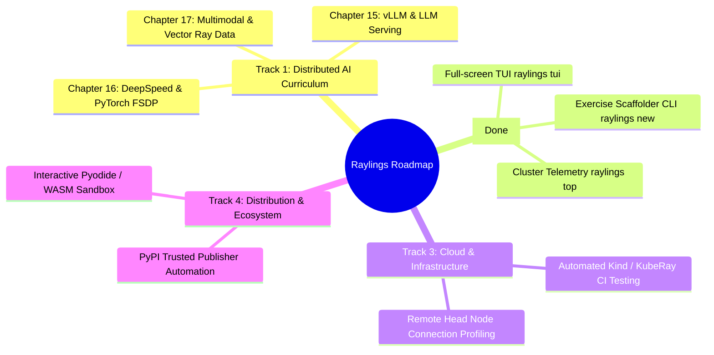

# Raylings Backlog & Future Roadmap

This document outlines the strategic backlog, upcoming features, and long-term roadmap for **Raylings**.

---

## 🗺️ Roadmap Tracks Overview

---

## Track 1: Next-Gen Distributed AI Curriculum (In Progress 🚀)

Expanding the core curriculum from 14 chapters (66 exercises) with 3 advanced distributed AI and Generative AI chapters:

### Chapter 15: Distributed LLM Serving with vLLM & Ray
- **`vllm01.py`**: Multi-Worker Tensor Parallelism & Model Partitioning across Ray Actors.
- **`vllm02.py`**: PagedAttention & Continuous Batching KV-cache memory dynamics.
- **`vllm03.py`**: Dynamic Multi-LoRA Adapter Serving with Actor Pools.
- **`vllm04.py`**: Speculative Decoding & Draft Model Worker Coordination.

### Chapter 16: DeepSpeed & PyTorch FSDP (Fully Sharded Data Parallel)
- **`fsdp01.py`**: PyTorch FSDP with Ray Train `ScalingConfig` & multi-worker gradient sync.
- **`fsdp02.py`**: DeepSpeed ZeRO-1 / ZeRO-2 / ZeRO-3 memory sharding across Ray workers.
- **`fsdp03.py`**: Mixed Precision (BF16/FP8) & Activation Checkpointing optimization.
- **`fsdp04.py`**: Elastic fault-tolerant checkpoint save/resume to object storage.

### Chapter 17: Multimodal & Vector Ray Data Pipelines
- **`data_genai01.py`**: High-throughput streaming image and audio preprocessing with backpressure.
- **`data_genai02.py`**: GPU-accelerated batch embedding extraction using `ActorPoolStrategy`.
- **`data_genai03.py`**: Dynamic sequence length bucketing and padding minimization.
- **`data_genai04.py`**: Parallel streaming dataset ingestion into vector databases (LanceDB / Milvus).

---

## Track 2: Developer Tooling & CLI Experience (Completed ✅)

1. **Interactive Full-Screen TUI (`raylings tui`)**:
   - Built with Rich `Layout`, `Live`, and interactive non-blocking keystroke listener.
   - Split-pane layout: live curriculum chapter outline with status badges on the left; syntax-highlighted code preview, real-time evaluation logs, progressive hint drawer, and cluster telemetry overlays on the right.
   - Full keyboard navigation (`[r]` Run, `[h]` Hint, `[j/↓]` Down, `[k/↑]` Up, `[n]` Next, `[p]` Prev, `[t]` Telemetry, `[d]` Doctor, `[q]` Quit).
2. **Exercise Scaffolding Tool (`raylings new` / `raylings new-exercise <chapter> <name>`)**:
   - Single command to generate skeleton exercise, canonical solution, verify harness, and manifest entry snippet.
   - Options for `--title`, `--description`, `--dry-run`, and `--json`.
3. **Cluster Health & Telemetry Inspector (`raylings top` / `raylings metrics`)**:
   - Live terminal view of Plasma object store memory utilization, spill rate, worker CPU/GPU saturation, and GCS actor tables.
   - Options for `--interval`, `--once`, and `--json`.

---

## Track 3: Cloud & Enterprise Infrastructure Testing (Backlog 📋)

1. **Automated Ephemeral KubeRay CI**:
   - Test harness using KinD (Kubernetes in Docker) to spin up ephemeral Kubernetes clusters in CI and validate Chapter 14 KubeRay manifests against a real KubeRay operator.
2. **Multi-Node Cluster Simulation Harness**:
   - Enhanced mock cluster runners for complex network partitioning and failover scenarios.

---

## Track 4: Ecosystem & Community (Backlog 📋)

1. **Browser-Based Interactive Sandbox**:
   - Lightweight WASM / WebAssembly Pyodide playground for exploring foundational Ray concepts in the browser without local Python installation.
2. **Community Exercise Registry**:
   - Pluggable exercise packs for domain-specific ecosystems (e.g. BioRay, Ray Geospatial, Ray Finance).
