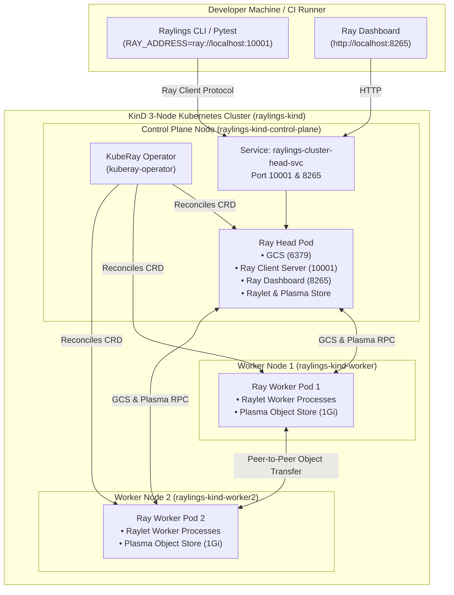
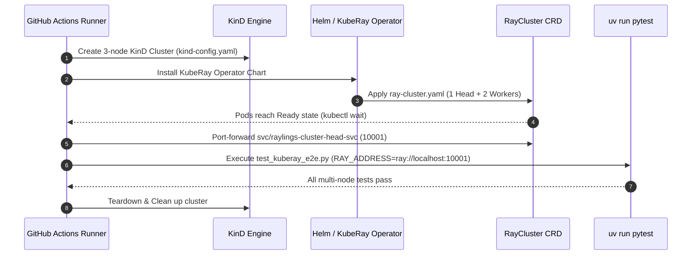

# Cloud & Multi-Node KubeRay Deployment ☸️

This guide covers deploying, testing, and managing multi-node Python Ray clusters on Kubernetes using **KinD** (Kubernetes in Docker) and the official **KubeRay Operator**.

---

## 🏗️ Architecture Overview

Raylings provides first-class support for multi-node Kubernetes deployments. While single-node local Ray sessions are ideal for rapid iterative learning, production AI and data engineering workloads run on distributed Kubernetes clusters orchestrated by the KubeRay operator.



### Core Components

1. **KinD Multi-Node Cluster (`scripts/kuberay/kind-config.yaml`)**:
   - 1 control-plane node with container port mappings (10001 for Ray Client, 8265 for Dashboard, 6379 for GCS).
   - 2 dedicated worker nodes to simulate a true multi-host physical topology.
2. **KubeRay Operator**:
   - Kubernetes Custom Controller that manages the lifecycle of Ray clusters, jobs, and services.
   - Watches `RayCluster`, `RayJob`, and `RayService` Custom Resource Definitions (CRDs).
3. **RayCluster Custom Resource (`scripts/kuberay/ray-cluster.yaml`)**:
   - Defines 1 Ray Head pod (`rayproject/ray:2.30.0-py310`) and 2 Ray Worker pods.
   - Configures CPU and memory limits, readiness probes, and internal networking services.

---

## 📋 Prerequisites

To run multi-node KubeRay clusters locally, ensure the following tools are installed:

- **Docker**: Docker Engine 20.10+ or Docker Desktop running.
- **KinD**: Kubernetes in Docker (`kind` v0.20.0+).
- **kubectl**: Kubernetes CLI (`kubectl` v1.28+).
- **Helm**: Kubernetes Package Manager (`helm` v3.12+).
- **uv / Python**: Python 3.10+ with `raylings` installed.

=== "macOS (Homebrew)"

    ```bash
    brew install kind kubectl helm
    ```

=== "Linux (Debian / Ubuntu)"

    ```bash
    # Install KinD
    [ $(uname -m) = x86_64 ] && curl -Lo ./kind https://kind.sigs.k8s.io/dl/v0.24.0/kind-linux-amd64
    chmod +x ./kind && sudo mv ./kind /usr/local/bin/kind

    # Install kubectl & Helm
    sudo snap install kubectl --classic
    sudo snap install helm --classic
    ```

---

## 🚀 Local Cluster Lifecycle Management

Raylings includes an automated cluster lifecycle script located at `scripts/kuberay/setup-kuberay.sh`.

### 1. Provision Cluster (`up`)

Bootstraps the 3-node KinD cluster, installs the KubeRay Helm operator, applies the `RayCluster` specification, and blocks until all pods reach the `Ready` state:

```bash
bash scripts/kuberay/setup-kuberay.sh up
```

Expected output:
```text
[INFO] Checking prerequisites...
[SUCCESS] All prerequisites are satisfied.
[INFO] Creating KinD cluster 'raylings-kind' using scripts/kuberay/kind-config.yaml...
[SUCCESS] KinD cluster 'raylings-kind' created.
[INFO] Installing / upgrading KubeRay operator via Helm...
[INFO] Waiting for KubeRay operator deployment to be Available...
deployment.apps/kuberay-operator condition met
[SUCCESS] KubeRay operator is running.
[INFO] Applying RayCluster manifest scripts/kuberay/ray-cluster.yaml...
raycluster.ray.io/raylings-cluster created
[INFO] Waiting for Ray head pod to be Ready (timeout 180s)...
pod/raylings-cluster-head-xxxxx condition met
[INFO] Waiting for Ray worker pods to be Ready (timeout 180s)...
pod/raylings-cluster-ray-worker-group-worker-xxxxx condition met
pod/raylings-cluster-ray-worker-group-worker-yyyyy condition met
[SUCCESS] All Ray cluster pods are Ready.
[SUCCESS] KubeRay cluster 'raylings-cluster' is fully up and ready!
```

---

### 2. Port-Forwarding Services (`forward`)

Forward the Ray Client port (`10001`) and the interactive Ray Dashboard (`8265`) to localhost in the background:

```bash
bash scripts/kuberay/setup-kuberay.sh forward
```

Output:
```text
[INFO] Starting background port-forwarding for svc/raylings-cluster-head-svc...
[SUCCESS] Port-forwarding established (PID: 12345).
  - Ray Client:    ray://localhost:10001
  - Ray Dashboard: http://localhost:8265
  - Forward Logs:  /tmp/kuberay-port-forward.log
```

Open [http://localhost:8265](http://localhost:8265) in your web browser to view the Ray Dashboard, node resource gauges, and actor placement tables.

---

### 3. Inspect Cluster Health (`status`)

Query KinD node statuses, KubeRay CRD state, Ray pods, and head service bindings:

```bash
bash scripts/kuberay/setup-kuberay.sh status
```

Output:
```text
=== KinD Nodes ===
NAME                          STATUS   ROLES           AGE   VERSION
raylings-kind-control-plane   Ready    control-plane   2m    v1.31.0
raylings-kind-worker          Ready    <none>          2m    v1.31.0
raylings-kind-worker2         Ready    <none>          2m    v1.31.0

=== RayCluster CRD Status ===
NAME               DESIRED WORKERS   AVAILABLE WORKERS   STATUS   AGE
raylings-cluster   2                 2                   ready    2m

=== Ray Pods ===
NAME                                                 READY   STATUS    NODE
raylings-cluster-head-xxxxx                          1/1     Running   raylings-kind-control-plane
raylings-cluster-ray-worker-group-worker-xxxxx       1/1     Running   raylings-kind-worker
raylings-cluster-ray-worker-group-worker-yyyyy       1/1     Running   raylings-kind-worker2
```

---

### 4. Teardown Cluster (`down`)

Terminates background port forwarding and deletes the KinD cluster:

```bash
bash scripts/kuberay/setup-kuberay.sh down
```

---

## 🔌 Connecting to the Remote Cluster

When executing exercises or running the test suite, tell Ray to connect to the remote KubeRay cluster using the `RAY_ADDRESS` environment variable:

```bash
# Set environment variable for remote execution
export RAY_ADDRESS="ray://localhost:10001"
```

### Running Raylings Exercises Remotely

```bash
# Run a specific exercise on the remote KubeRay cluster
RAY_ADDRESS=ray://localhost:10001 raylings run exercises/14_kuberay/kuberay01.py

# Run continuous watcher against the remote cluster
RAY_ADDRESS=ray://localhost:10001 raylings watch
```

### Programmatic Connection in Python

In your Python scripts or tests, initialize Ray with the remote address:

```python
import ray

# Connect to the remote KubeRay cluster via Ray Client
ray.init(address="ray://localhost:10001", ignore_reinit_error=True)

# Query live nodes across the Kubernetes cluster
nodes = ray.nodes()
print(f"Connected to Ray cluster with {len(nodes)} nodes:")
for node in nodes:
    if node.get("Alive"):
        print(f"  - Node ID: {node['NodeID']} (IP: {node['NodeManagerAddress']})")
```

---

## 🧪 Multi-Node End-to-End Test Suite

Raylings includes a comprehensive end-to-end multi-node integration test suite located in `tests/test_kuberay_e2e.py`.

### Running the Test Suite

```bash
# Run against the active KubeRay cluster
RAY_ADDRESS=ray://localhost:10001 uv run pytest tests/test_kuberay_e2e.py -v
```

!!! note "Automatic In-Process Fallback"
    If no live KubeRay cluster or `RAY_ADDRESS` is detected, `test_kuberay_e2e.py` automatically spins up an in-process 2-node simulated cluster using `ray.cluster_utils.Cluster` to ensure seamless local testing.

### Test Scenarios Covered

| Test Function | Verification Scope |
| :--- | :--- |
| `test_kuberay_cluster_node_discovery` | Verifies cluster topology discovery and confirms $\ge 2$ active nodes in GCS. |
| `test_kuberay_actor_cross_node_scheduling` | Verifies Raylet actor scheduling distributes workers across distinct node IPs with `SPREAD` strategy. |
| `test_kuberay_placement_group_strict_spread` | Verifies that `STRICT_SPREAD` placement groups strictly enforce node anti-affinity. |
| `test_kuberay_cross_node_plasma_transfer` | Puts heavy NumPy (8MB) and PyArrow (50k rows) datasets into Node A's Plasma store, transfers them to Node B, and asserts bit-for-bit integrity without corruption. |
| `test_kuberay_ray_train_torch_multinode` | Launches distributed `TorchTrainer` across 2 worker nodes, synchronizing PyTorch DDP gradients across pod boundaries. |
| `test_kuberay_ray_data_multinode_streaming` | Executes a streaming `ray.data.range(100).map(...)` ETL pipeline and verifies records are processed across multiple node IPs. |

---

## 🔄 GitHub Actions CI Pipeline Architecture

Every commit affecting KubeRay manifests, test suites, or CI workflows triggers `.github/workflows/kuberay-e2e.yml`.



### Diagnostic Artifact Collection

If any step in the CI pipeline fails, the workflow automatically runs diagnostic dumps:
- `kubectl get pods -A` (lists all pods across namespaces).
- `kubectl describe rayclusters` (inspects operator reconciliation events).
- `kubectl logs -l ray.io/node-type=head` (captures Ray head logs).
- `kubectl logs -l app.kubernetes.io/name=kuberay-operator` (captures operator logs).

---

## 🛠️ Troubleshooting Common KubeRay Issues

### 1. Pods Stuck in `Pending` State

#### Symptom
```text
NAME                                            READY   STATUS    RESTARTS   AGE
raylings-cluster-ray-worker-group-worker-xxx   0/1     Pending   0          5m
```

#### Cause
The Kubernetes node (or Docker engine) has insufficient CPU or memory to satisfy the pod's resource requests.

#### Solution
Inspect pod scheduling events:
```bash
kubectl describe pod raylings-cluster-ray-worker-group-worker-xxx
```
Look for `0/3 nodes are available: 3 Insufficient cpu`.
- Increase Docker Desktop memory allocation (recommended: $\ge 8\text{ GB}$).
- Or reduce pod resource requests in `scripts/kuberay/ray-cluster.yaml`.

---

### 2. Ray Client Port Connection Refused (`ray://localhost:10001`)

#### Symptom
```text
ConnectionError: Failed to connect to Ray client at localhost:10001
```

#### Cause
The background `kubectl port-forward` process was terminated, or the Ray head pod is not yet listening on port 10001.

#### Solution
1. Re-establish port-forwarding:
   ```bash
   bash scripts/kuberay/setup-kuberay.sh forward
   ```
2. Verify head pod logs:
   ```bash
   kubectl logs -l ray.io/node-type=head -c ray-head
   ```

---

### 3. Cross-Node Plasma Object Store Memory Exhaustion

#### Symptom
```text
ray.exceptions.RaySystemError: Object store full: Failed to put object in Plasma store.
```

#### Cause
In Kubernetes environments, `/dev/shm` default size may be limited to 64MB unless an `emptyDir` with `medium: Memory` is mounted, or pod memory limits are too low for large dataset shuffling.

#### Solution
In `scripts/kuberay/ray-cluster.yaml`, ensure worker containers specify sufficient memory limits and volume mounts for shared memory:

```yaml
spec:
  containers:
    - name: ray-worker
      resources:
        limits:
          cpu: "1"
          memory: "2Gi"
        requests:
          cpu: "500m"
          memory: "1Gi"
      volumeMounts:
        - mountPath: /dev/shm
          name: dshm
  volumes:
    - name: dshm
      emptyDir:
        medium: Memory
        sizeLimit: 1Gi
```

---

## 📚 Related Resources

- [KubeRay Official Documentation](https://ray-project.github.io/kuberay/)
- [Chapter 14: KubeRay on Kubernetes Curriculum](syllabus.md#chapter-14-14_kuberay-kuberay-cloud-native-ray-on-kubernetes)
- [Troubleshooting Recipes](troubleshooting.md)
- [CLI Reference Manual](cli-reference.md)
