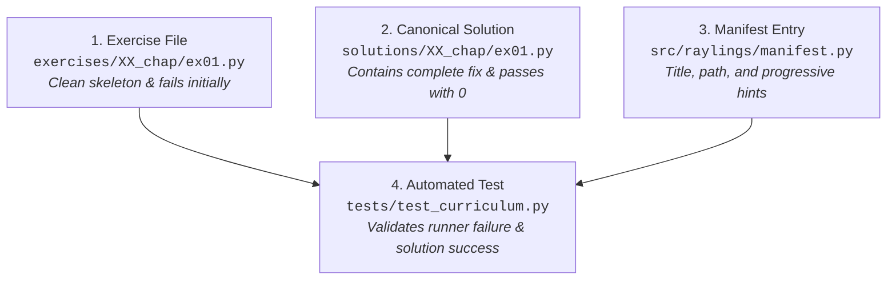

# Contributing to Raylings 🤝

Thank you for your interest in contributing to Raylings! We welcome contributions ranging from adding new exercises and improving curriculum hints to refining documentation, optimizing CLI performance, and expanding IDE extensions.

---

## 🛠️ Contributor Development Setup

Raylings uses [uv](https://docs.astral.sh/uv/) for Python package management, virtual environment isolation, and dependency locking.

### 1. Clone the Repository

```bash
git clone https://github.com/dnf0/raylings.git
cd raylings
```

### 2. Set Up Virtual Environment

```bash
# Create Python 3.12 virtual environment
uv venv --python 3.12
source .venv/bin/activate

# Install editable package with dev and docs dependency groups
uv pip install -e ".[dev,docs]"
```

---

## ✍️ Exercise Authoring Standards

Every exercise in Raylings follows a strict 4-part contract to ensure high curriculum quality and automated testability.



### 1. The Exercise File (`exercises/XX_chapter/name.py`)

- Must include a clear module docstring stating:
    - Exercise name
    - Topic
    - Educational objective / Context & Why
    - Step-by-step instructions
- Must have an intentional cloze blank (`None`, `???`, `___`, or empty placeholder) or incomplete `# TODO:` that causes the script to fail assertions or raise errors when executed unmodified.
- Must contain an executable `verify()` function and `if __name__ == "__main__":` block with assertions validating the solution.

```python
"""
Exercise: custom_example01.py
Topic: Custom Actor Superpower

Context & Why:
Implement an actor method that safely computes distributed sums.
"""

import ray


@ray.remote
class Summer:
    def __init__(self) -> None:
        self.total = 0

    def add(self, value: int) -> int:
        # TODO: Implement addition logic
        pass


def verify() -> None:
    ray.init(ignore_reinit_error=True)
    summer = Summer.remote()
    res = ray.get(summer.add.remote(10))
    assert res == 10, f"Expected 10, got {res}"
    print("✓ Success!")


if __name__ == "__main__":
    verify()
```

---

### 2. The Canonical Solution (`solutions/XX_chapter/name.py`)

- Must be placed at the exact mirrored path under `solutions/` (e.g. `solutions/XX_chapter/name.py`).
- Must implement the complete, correct solution.
- Must exit cleanly with status code `0` when executed directly via Python.

---

### 3. Registering in the Manifest (`src/raylings/manifest.py`)

Add your new exercise to the corresponding `Chapter` definition in `src/raylings/manifest.py`:

```python
Exercise(
    name="custom_example01",
    title="Custom Actor Superpower",
    path="exercises/XX_chapter/custom_example01.py",
    chapter_name="XX_chapter",
    hints=[
        "Define an internal state attribute in __init__.",
        "Mutate self.total inside the add method and return self.total.",
    ],
)
```

---

### 4. Automated Tests & Solution Verification

Ensure that the automated test suite validates both the exercise and solution:

```bash
# Verify canonical reference solutions
uv run raylings test custom_example01

# Test all solutions across the curriculum
uv run raylings test --all
```

---

## 🔍 Quality Assurance & Verification Commands

Before submitting a pull request, run the following verification suite:

### 1. Code Formatting & Linting

```bash
# Check code style and lint rules with Ruff
uv run ruff check .

# Auto-format all code
uv run ruff format .
```

### 2. Unit & Integration Tests

```bash
# Run non-heavy test suite
uv run pytest -m "not heavy" -v

# Run full test suite including multi-worker exercises
uv run pytest -v
```

### 3. Strict Documentation Build

```bash
# Build documentation with strict link and schema validation
uvx --with mkdocs-material mkdocs build --strict
```

---

## 🔀 Git Workflow & Pull Requests

### Branch Naming Policy

- Feature branches: `feat/chapter-15-llm-serving`
- Bug fixes: `fix/daemon-port-cleanup`
- Documentation: `docs/update-kuberay-guide`

### Conventional Commits

We follow the [Conventional Commits](https://www.conventionalcommits.org/) specification:

- `feat(curriculum): add ray data streaming backpressure exercise`
- `fix(watcher): handle rapid file save debounce correctly`
- `docs(troubleshooting): add recipe for DDP deadlocks`
- `chore(deps): bump mkdocs-material to 9.5.40`

### Submitting a Pull Request

1. Push your feature branch to your fork.
2. Open a Pull Request against the `main` branch.
3. Ensure all automated CI checks (Ruff linting, pytest, strict MkDocs build) pass.
4. Address review feedback and merge!
