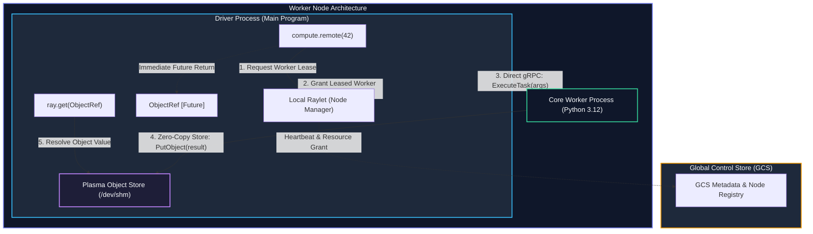
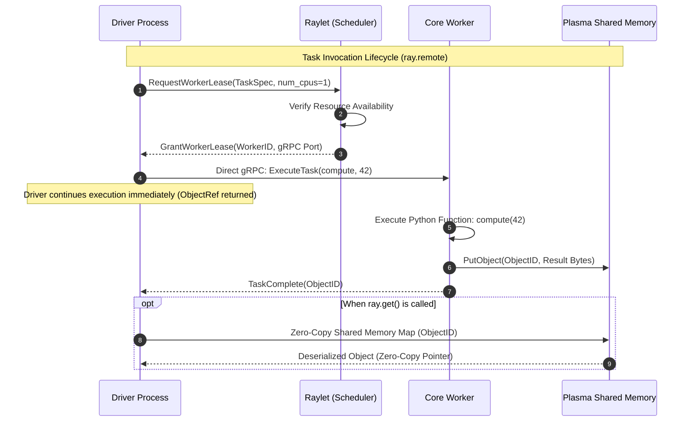

# Chapter 01: Remote Tasks, ObjectRefs & Asynchronous Execution

<div class="grid cards" markdown>

-   :material-school: **Topic Focus** &bull; `@ray.remote` Functions, Futures, Asynchronous Concurrency, and Batch Evaluation
-   :material-play-circle: **Interactive Challenges** &bull; 6 Hands-on Exercises
-   :material-rocket-launch: [**Launch Playground in Wasm →**](../playground/index.html?chapter=1){ .md-button .md-button--primary }

</div>

---

## 1. Architectural Overview & Control Plane Mechanics

In Ray, **Tasks** represent stateless, asynchronous functions executed across worker processes. When a task is invoked using `.remote()`, Ray immediately returns an `ObjectRef` (a future) without blocking the calling thread.





The Ray core scheduler decouples task submission from execution: the driver acquires a worker lease from the local Raylet, initiates execution via direct worker-to-worker gRPC, and resolves return values asynchronously through the local Plasma zero-copy shared memory store.

---

## 2. Annotated Python Code Anatomy & API Reference

Below is a production pattern for remote tasks, parallel batching, and async wait operations:

```python
import ray
from typing import List

# 1. Initialize Ray cluster connection or local embedded engine
ray.init(ignore_reinit_error=True)

# 2. Decorate stateless function with @ray.remote
@ray.remote(num_cpus=1)
def process_partition(partition_id: int, records: List[dict]) -> dict:
    """Processes a discrete data partition asynchronously across workers."""
    transformed = [r["val"] * 2 for r in records if "val" in r]
    return {"partition_id": partition_id, "count": len(transformed), "sum": sum(transformed)}

# 3. Launch parallel asynchronous tasks
data_batches = [[{"val": i} for i in range(100)] for _ in range(4)]
futures: List[ray.ObjectRef] = [
    process_partition.remote(idx, batch) for idx, batch in enumerate(data_batches)
]

# 4. Resolve futures concurrently with ray.get or non-blocking ray.wait
ready_refs, unready_refs = ray.wait(futures, num_returns=len(futures), timeout=5.0)
results = ray.get(ready_refs)
```

### Key API Parameter Reference

- **`@ray.remote(num_cpus=1, num_gpus=0)`**: Declares the task and its scheduling resource requirements.
- **`func.remote(*args, **kwargs)`**: Dispatches the task asynchronously and returns an `ObjectRef`.
- **`ray.get(object_refs)`**: Synchronously blocks until the referenced object(s) are resolved and deserialized.
- **`ray.wait(object_refs, num_returns=1, timeout=None)`**: Non-blocking partition of finished vs. pending futures.

---

## 3. Production Best Practices & Hardening Guidelines

1. **Avoid Fine-Grained Tasks**: Ensure each remote task executes for at least 10–50ms to amortize scheduling and IPC serialization overhead.
2. **Never Call `ray.get()` in Loops**: Calling `ray.get()` inside a `for` loop serializes execution; launch all `.remote()` calls first, then resolve in bulk.
3. **Pass `ObjectRef`s Directly**: Pass ObjectRefs into downstream tasks rather than calling `ray.get()` on the driver; Ray will resolve dependencies automatically on the target worker.
4. **Specify Explicit Resource Demands**: Always set `num_cpus` or memory limits to prevent worker over-subscription.
5. **Handle Timeouts in `ray.wait`**: Always provide a bounded `timeout` when waiting on dynamic tasks to avoid driver deadlocks.

---

## 4. Troubleshooting & Diagnostic Workflows

1. **Worker Process Exhaustion**:
   - *Symptom*: Cluster hangs or scheduler logs "Too many pending tasks".
   - *Fix*: Avoid infinite unconstrained task launches; use a semaphore or `ray.wait()` pipeline to bound concurrent in-flight tasks.
2. **Driver Memory Spike during `ray.get()`**:
   - *Symptom*: Out-of-memory error on driver node.
   - *Fix*: Process partitions in batches or stream results with generator tasks instead of resolving large datasets to the driver.
3. **Serialization Failures (`TypeError: cannot pickle...`)**:
   - *Symptom*: Task submission fails with serialization errors.
   - *Fix*: Ensure closures and arguments do not capture non-serializable objects (e.g., active database sockets or open file descriptors).

---

## 5. Hands-on Practice Exercises

| Exercise ID | Goal / Topic | Playground Link |
| :--- | :--- | :--- |
| `basics01` | Ray Init & First Remote Task | [**Open Exercise basics01 →**](../playground/index.html?exercise=basics01) |
| `basics02` | ObjectRefs and ray.get() | [**Open Exercise basics02 →**](../playground/index.html?exercise=basics02) |
| `basics03` | Parallel Pipeline Execution | [**Open Exercise basics03 →**](../playground/index.html?exercise=basics03) |
| `basics04` | Passing ObjectRefs to Tasks | [**Open Exercise basics04 →**](../playground/index.html?exercise=basics04) |
| `basics05` | Dynamic Completion with ray.wait() | [**Open Exercise basics05 →**](../playground/index.html?exercise=basics05) |
| `basics06` | Multiple Returns in Remote Tasks | [**Open Exercise basics06 →**](../playground/index.html?exercise=basics06) |
