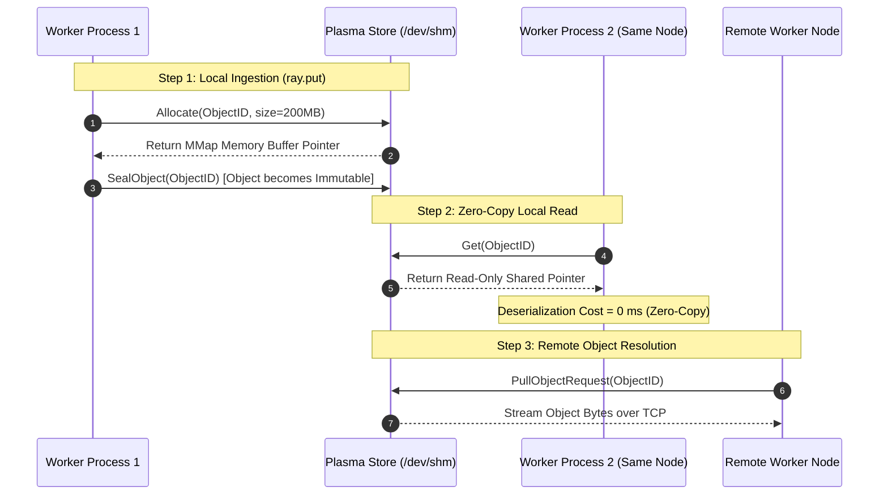

# Chapter 03: Plasma Shared-Memory Object Store & Zero-Copy Deserialization

<div class="grid cards" markdown>

-   :material-school: **Topic Focus** &bull; Plasma Object Store, `ray.put()`, Shared Memory (SHM), and Zero-Copy Deserialization
-   :material-play-circle: **Interactive Challenges** &bull; 6 Hands-on Exercises
-   :material-rocket-launch: [**Launch Playground in Wasm →**](../playground/index.html?chapter=3){ .md-button .md-button--primary }

</div>

---

## 1. Architectural Overview & Control Plane Mechanics

Ray utilizes an in-memory shared object store (**Plasma**) on each cluster node. Objects stored in Plasma are immutable and managed via Apache Arrow shared memory segments (`/dev/shm`).

```mermaid
flowchart TD
    subgraph NodeHost["Physical Node Architecture (Local Host)"]
        subgraph Workers["Worker Processes (Core Workers)"]
            W1["Worker A (Python 3.12)"]
            W2["Worker B (Python 3.12)"]
            W3["Worker C (Python 3.12)"]
        end

        subgraph PlasmaMemory["POSIX Shared Memory Subsystem (/dev/shm)"]
            PS_Daemon["Plasma Store Daemon (Object Store Engine)"]
            subgraph ShmBuffers["Immutable Shared Memory Segments"]
                Buf1["NumPy Tensor Buffer / PyArrow Table (ReadOnly)"]
            end
        end

        W1 -->|"1. ray.put() / Object Creation"| PS_Daemon
        PS_Daemon -->|"Allocate Buffer"| Buf1
        W1 -.->|"Zero-Copy mmap Pointer"| Buf1
        W2 -.->|"Zero-Copy mmap Pointer"| Buf1
        W3 -.->|"Zero-Copy mmap Pointer"| Buf1
    end

    subgraph Spilling["Object Spilling Subsystem (Under High Memory Pressure)"]
        PS_Daemon -->|"LRU Eviction Spill"| LocalSSD["Local NVMe Scratch Disk"]
        PS_Daemon -->|"Distributed Spill"| CloudS3["Cloud Storage (S3 / GCS / Azure Blob)"]
    end

    subgraph RemoteCluster["Remote Worker Node"]
        RemoteRaylet["Remote Raylet Node Manager"]
        RemoteRaylet <==|"Cross-Node Object Pull (gRPC/TCP)"| PS_Daemon
    end

    style NodeHost fill:#0f172a,stroke:#38bdf8,stroke-width:2px,color:#f8fafc
    style PlasmaMemory fill:#1e1e38,stroke:#c084fc,stroke-width:2px,color:#f8fafc
    style Spilling fill:#1e293b,stroke:#f59e0b,stroke-width:2px,color:#f8fafc
    style RemoteCluster fill:#1e293b,stroke:#34d399,stroke-width:2px,color:#f8fafc
    style Buf1 fill:#0f172a,stroke:#c084fc,stroke-width:2px,color:#f8fafc
```



When multiple worker processes on the same physical host read a NumPy array or PyArrow table stored in Plasma, they read directly from the shared memory pointer with **zero deserialization copy overhead**. Under memory pressure, Plasma automatically spills least-recently-used objects to local NVMe or cloud storage.

---

## 2. Annotated Python Code Anatomy & API Reference

```python
import ray
import numpy as np

# 1. Put a large data structure into Plasma once
large_matrix = np.ones((5000, 5000), dtype=np.float64)  # ~200MB
matrix_ref = ray.put(large_matrix)

# 2. Remote task consuming the ObjectRef with zero-copy access
@ray.remote
def row_sum_worker(ref: ray.ObjectRef, row_idx: int) -> float:
    # Worker accesses matrix in shared memory without copying
    data = ray.get(ref) if isinstance(ref, ray.ObjectRef) else ref
    return float(np.sum(data[row_idx, :]))

# 3. Pass ObjectRef to multiple tasks without duplicating in-flight memory
futures = [row_sum_worker.remote(matrix_ref, i) for i in range(10)]
partial_sums = ray.get(futures)
```

### Key API Parameter Reference

- **`ray.put(value)`**: Serializes an object with Apache Arrow and places it in the local Plasma store, returning an `ObjectRef`.
- **`ray.get(ref)`**: Reads and returns the deserialized Python object. For Arrow/NumPy objects, returns zero-copy read-only views.
- **`ray.experimental.internal_kv`**: Accesses distributed cluster metadata store.

---

## 3. Production Best Practices & Hardening Guidelines

1. **Pre-`ray.put()` Large Read-Only Arguments**: When passing an argument > 100KB to multiple remote tasks, call `ray.put(data)` once and pass the resulting `ObjectRef`.
2. **Beware of In-Place Modifications**: Arrays retrieved via zero-copy from Plasma are read-only (`data.flags.writeable == False`); make an explicit copy (`data.copy()`) only if mutations are necessary.
3. **Monitor `/dev/shm` Size**: Configure `--object-store-memory` appropriately (typically 30–50% of available node RAM) to prevent early disk spilling.
4. **Avoid Small `ray.put()` Overheads**: Objects smaller than 100KB should be passed directly as function arguments to avoid object store registration overhead.
5. **Manage Object Lifetimes**: Ray automatically garbage-collects objects from Plasma when all `ObjectRef` references go out of scope. Avoid storing `ObjectRef`s in unbounded global lists.

---

## 4. Troubleshooting & Diagnostic Workflows

1. **Object Store Full & Heavy Disk Spilling**:
   - *Symptom*: High I/O wait times and logs warning "Spilled X GB to disk".
   - *Fix*: Release lingering `ObjectRef` variables; increase `/dev/shm` size or scale cluster worker nodes.
2. **`ValueError: assignment destination is read-only`**:
   - *Symptom*: Mutating an array returned by `ray.get()` crashes.
   - *Fix*: Call `.copy()` on the NumPy array before writing to its buffer.
3. **High Inter-Node Transfer Latency**:
   - *Symptom*: Workers on other nodes stall during `ray.get()`.
   - *Fix*: Place interdependent tasks on the same node using Placement Groups or `NodeAffinitySchedulingStrategy`.

---

## 5. Hands-on Practice Exercises

| Exercise ID | Goal / Topic | Playground Link |
| :--- | :--- | :--- |
| `object_store01` | Zero-Copy Plasma Reads | [**Open Exercise object_store01 →**](../playground/index.html?exercise=object_store01) |
| `object_store02` | ray.put() vs Implicit Serialization | [**Open Exercise object_store02 →**](../playground/index.html?exercise=object_store02) |
| `object_store03` | Object Immutability & Read-Only Semantics | [**Open Exercise object_store03 →**](../playground/index.html?exercise=object_store03) |
| `object_store04` | Object Spilling & Memory Limits | [**Open Exercise object_store04 →**](../playground/index.html?exercise=object_store04) |
| `object_store05` | Handling & Resolving Nested ObjectRefs | [**Open Exercise object_store05 →**](../playground/index.html?exercise=object_store05) |
| `object_store06` | Custom Serializers with ray.util | [**Open Exercise object_store06 →**](../playground/index.html?exercise=object_store06) |
