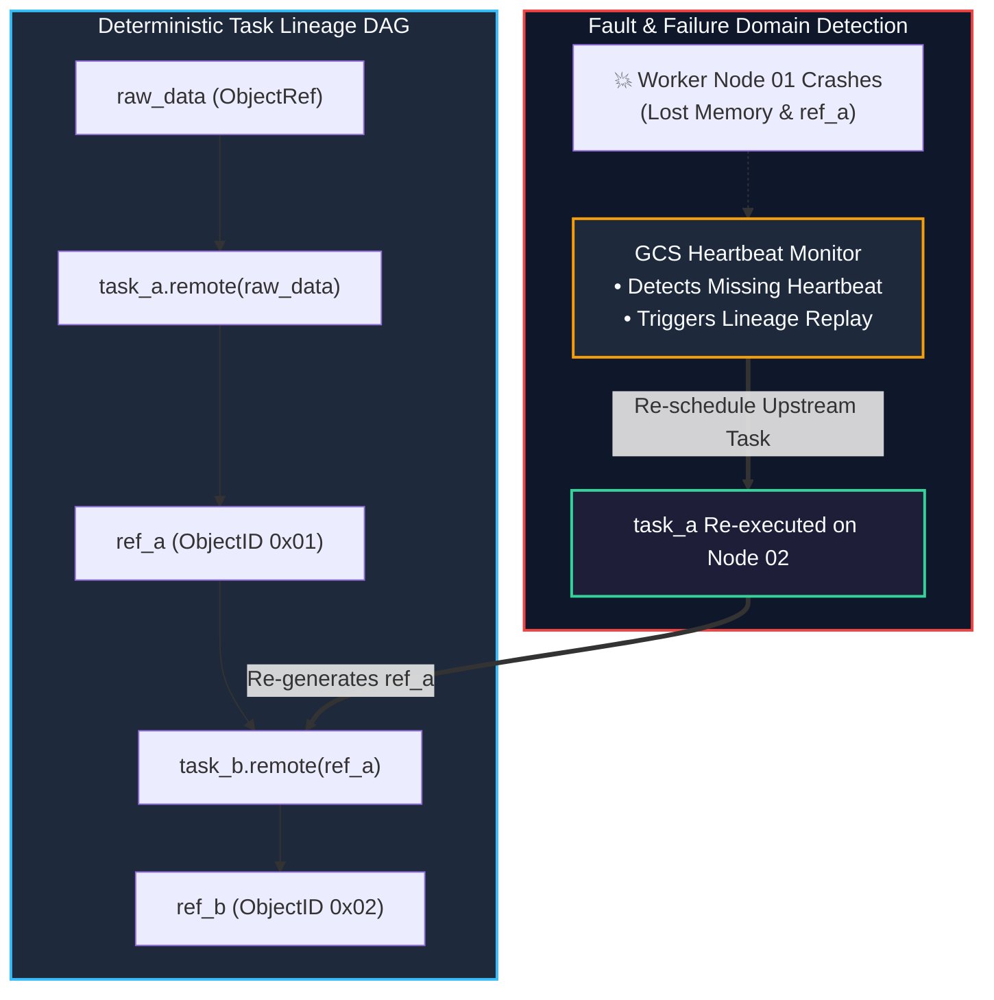
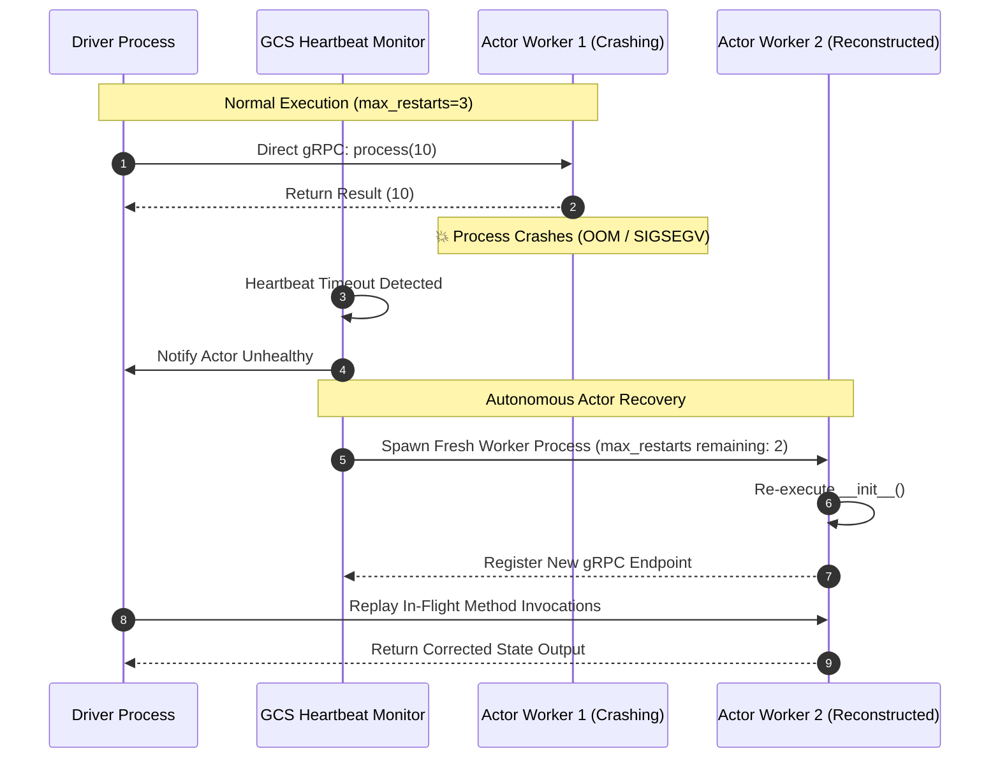

# Chapter 05: Lineage Reconstruction, Fault Tolerance & Actor Retries

<div class="grid cards" markdown>

-   :material-school: **Topic Focus** &bull; Task Retries, Lineage Reconstruction, Actor Restarts, and Object Loss Recovery
-   :material-play-circle: **Interactive Challenges** &bull; 4 Hands-on Exercises
-   :material-rocket-launch: [**Launch Playground in Wasm →**](../playground/index.html?chapter=5){ .md-button .md-button--primary }

</div>

---

## 1. Architectural Overview & Control Plane Mechanics

Ray provides distributed fault tolerance by recording the **lineage graph** (the sequence of function calls and arguments) used to generate every `ObjectRef`.





If a worker node crashes and an in-memory object is lost, Ray automatically inspects the lineage graph and re-executes upstream tasks on healthy nodes. For stateful actors configured with `max_restarts`, GCS spawns a replacement worker process and reroutes subsequent invocations seamlessly.

---

## 2. Annotated Python Code Anatomy & API Reference

```python
import ray
import random

# 1. Configure automatic task retries on failure
@ray.remote(max_retries=3, retry_exceptions=True)
def flaky_external_api_task(item_id: str) -> dict:
    """Task that retries automatically upon intermittent network exceptions."""
    if random.random() < 0.5:
        raise ConnectionResetError("Transient network failure")
    return {"status": "success", "item_id": item_id}

# 2. Configure resilient stateful actor with automatic restart & state recovery
@ray.remote(max_restarts=3, max_task_retries=2)
class ResilientWorker:
    def __init__(self, partition_id: int):
        self.partition_id = partition_id
        self.state_counter = 0

    def process(self, value: int) -> int:
        self.state_counter += value
        return self.state_counter

# 3. Instantiate resilient actor
actor = ResilientWorker.remote(1)
```

### Key API Parameter Reference

- **`@ray.remote(max_retries=N)`**: Maximum times a task is re-executed upon worker crash or application exception.
- **`@ray.remote(retry_exceptions=True)`**: Enables automatic retry on standard Python exceptions in addition to worker crashes.
- **`@ray.remote(max_restarts=N)`**: Maximum times an actor worker process is restarted if it dies.
- **`@ray.remote(max_task_retries=M)`**: Retries pending method calls on an actor following a restart.

---

## 3. Production Best Practices & Hardening Guidelines

1. **Ensure Task Idempotency**: Tasks configured with `max_retries > 0` must be idempotent to prevent duplicate side effects.
2. **Limit Retries for Deterministic Bugs**: Only set `retry_exceptions=True` for transient errors (e.g., network timeouts, rate limits).
3. **Persist Actor State to External Storage**: Actor restarts instantiate a fresh actor (`__init__`); reload persistent state from checkpoints (e.g. S3 / GCS / Redis).
4. **Disable Lineage for Volatile Generators**: For long-running streaming pipelines, disable lineage reconstruction (`max_retries=0`) and handle errors at the pipeline boundary.
5. **Monitor Task Retry Metrics**: Alert on elevated `ray_task_retry_count` Prometheus metrics to detect intermittent infrastructure degradation.

---

## 4. Troubleshooting & Diagnostic Workflows

1. **Infinite Crash Loop on Actor Restart**:
   - *Symptom*: Actor exceeds `max_restarts` and raises `ActorDiedError`.
   - *Fix*: Check actor `__init__` logic for unhandled exceptions or invalid external credentials.
2. **`ObjectLostError` during Lineage Reconstruction**:
   - *Symptom*: Object cannot be recovered because input arguments were freed or non-reproducible.
   - *Fix*: Keep root data persisted in durable storage; avoid capturing random state without seeds in tasks.
3. **Cascading Failure from OOM Worker Death**:
   - *Symptom*: Node kills worker due to OOM; task retries and kills next worker.
   - *Fix*: Adjust task memory resource requests (`@ray.remote(memory=...)`) to avoid repeated node OOM kills.

---

## 5. Hands-on Practice Exercises

| Exercise ID | Goal / Topic | Playground Link |
| :--- | :--- | :--- |
| `fault01` | Automatic Task Retries | [**Open Exercise fault01 →**](../playground/index.html?exercise=fault01) |
| `fault02` | Actor Failure & Restart Recovery | [**Open Exercise fault02 →**](../playground/index.html?exercise=fault02) |
| `fault03` | Lineage Reconstruction | [**Open Exercise fault03 →**](../playground/index.html?exercise=fault03) |
| `fault04` | Spot Instance & Preemption Handling | [**Open Exercise fault04 →**](../playground/index.html?exercise=fault04) |
