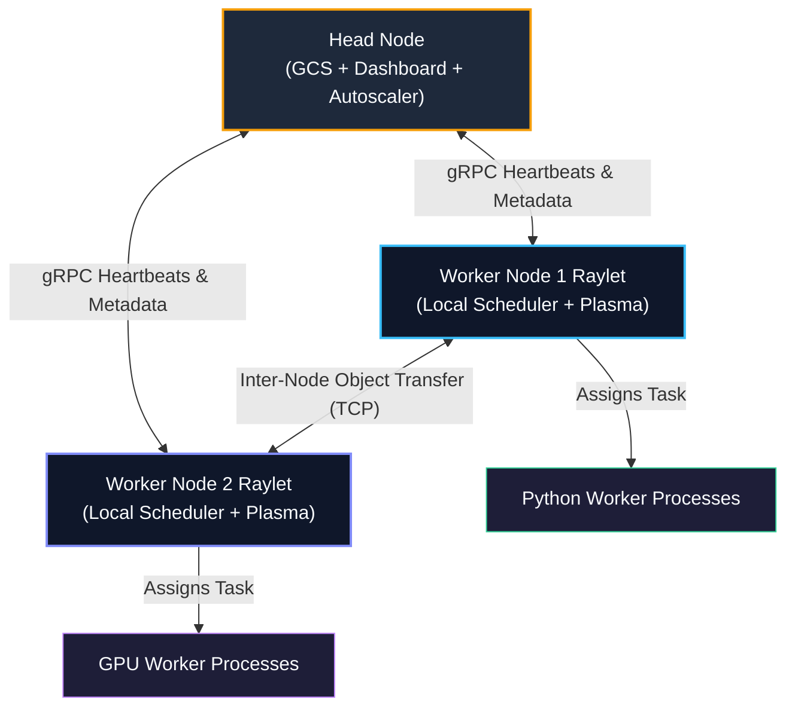

# Chapter 06: Cluster Architecture, Head Nodes & GCS Mechanics

<div class="grid cards" markdown>

-   :material-school: **Topic Focus** &bull; Global Control Store (GCS), Raylet Node Daemons, Head Nodes, and Worker Lifecycles
-   :material-play-circle: **Interactive Challenges** &bull; 4 Hands-on Exercises
-   :material-rocket-launch: [**Launch Playground in Wasm →**](../playground/index.html?chapter=6){ .md-button .md-button--primary }

</div>

---

## 1. Architectural Overview & Control Plane Mechanics

A Ray cluster consists of a single **Head Node** and zero or more **Worker Nodes**. Every node runs a local `raylet` daemon composed of a local scheduler and a Plasma object store.



> **Diagram Walkthrough & Core Concepts:**
> - **Decoupled Control Plane**: The Head Node hosts the Global Control Store (GCS) and cluster services, maintaining the actor registry, placement groups, and node membership without acting as a bottleneck for task execution.
> - **Autonomous Local Schedulers**: Each Worker Node runs a local `Raylet` daemon that schedules tasks directly onto local Python worker processes whenever resources are available.
> - **Direct Peer-to-Peer Data Transfer**: When a worker needs an object created on another node, the local Raylets stream the bytes directly over high-speed TCP/IP without routing through the Head Node.

---

## 2. Annotated Python Code Anatomy & API Reference

```python
import ray
from ray.util.state import list_nodes, list_actors, summarize_tasks

# 1. Inspect active cluster topology programmatically
cluster_nodes = list_nodes()
for node in cluster_nodes:
    print(f"Node ID: {node['node_id']} | IP: {node['node_ip_address']} | Alive: {node['is_alive']}")

# 2. Query actor states from GCS
active_actors = list_actors(filters=[("state", "=", "ALIVE")])
print(f"Active GCS Registered Actors: {len(active_actors)}")

# 3. Retrieve task execution summary
task_summary = summarize_tasks()
print(f"Pending tasks: {task_summary.get('PENDING', 0)}")
```

### Key API Parameter Reference

- **`ray.init(address="auto")`**: Connects to an existing running Ray cluster via GCS.
- **`ray.cluster_resources()`**: Returns total CPU, GPU, memory, and custom resources in the cluster.
- **`ray.available_resources()`**: Returns currently unallocated cluster resources.
- **`ray.util.state.list_nodes()`**: Lists physical/virtual node statuses in the cluster.

---

## 3. Production Best Practices & Hardening Guidelines

1. **Protect the GCS from Driver Overload**: Avoid registering millions of tiny actors in GCS; batch actor pools and rely on stateless tasks for massive concurrency.
2. **Configure GCS High Availability**: In production Kubernetes clusters, enable External GCS storage (Redis) or multi-replica GCS fault tolerance.
3. **Set Worker Node Heartbeat Timeouts**: Configure `raylet` heartbeat timeouts to quickly detect and evict dead cloud instances.
4. **Isolate Driver from Heavy Compute**: Run driver scripts on worker nodes or dedicated client pods rather than overburdening the Head Node.
5. **Monitor Object Directory Size**: Use GCS metrics to detect memory leaks in object reference tables.

---

## 4. Troubleshooting & Diagnostic Workflows

1. **Worker Node Marked Dead Unexpectedly**:
   - *Symptom*: Logs report "Node timed out heartbeating to GCS".
   - *Fix*: Check worker node network connectivity, MTU settings, or host CPU starvation.
2. **GCS OOM / Memory Pressure**:
   - *Symptom*: High latency on actor creation and task dispatch.
   - *Fix*: Limit number of distinct named actors and clean up finished placement groups.
3. **Autoscaler Flapping (Thrashing)**:
   - *Symptom*: Nodes repeatedly start and terminate.
   - *Fix*: Increase `idle_timeout_minutes` in autoscaler configuration to prevent premature scale-down.

---

## 5. Hands-on Practice Exercises

| Exercise ID | Goal / Topic | Playground Link |
| :--- | :--- | :--- |
| `cluster01` | Head Node, Workers & GCS | [**Open Exercise cluster01 →**](../playground/index.html?exercise=cluster01) |
| `cluster02` | Programmatic Cluster Simulation | [**Open Exercise cluster02 →**](../playground/index.html?exercise=cluster02) |
| `cluster03` | Simulating Node Death & Rescheduling | [**Open Exercise cluster03 →**](../playground/index.html?exercise=cluster03) |
| `cluster04` | Ray Job Submission API | [**Open Exercise cluster04 →**](../playground/index.html?exercise=cluster04) |
