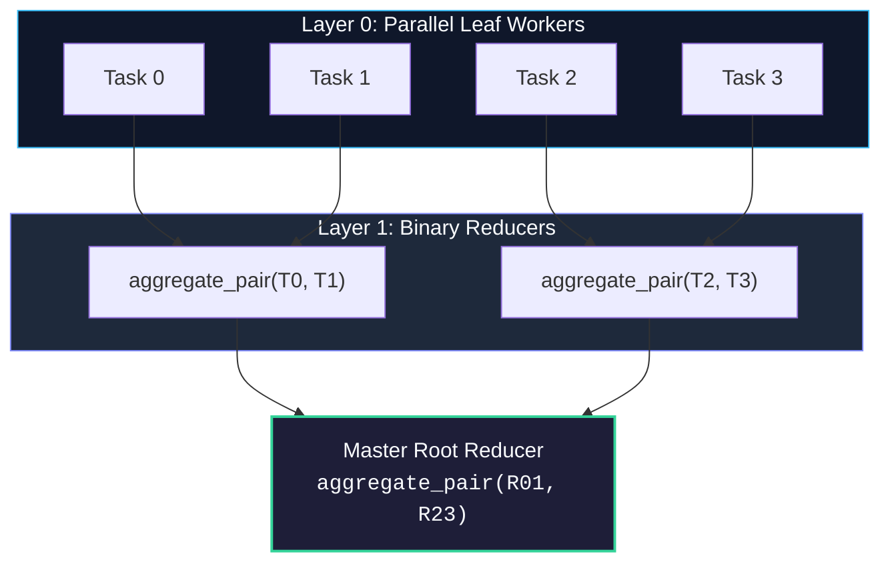

# Chapter 07: Ray Design Patterns & Anti-Patterns

<div class="grid cards" markdown>

-   :material-school: **Topic Focus** &bull; Distributed Design Patterns, Pipeline Architectures, Anti-Patterns, and Performance Traps
-   :material-play-circle: **Interactive Challenges** &bull; 4 Hands-on Exercises
-   :material-rocket-launch: [**Launch Playground in Wasm →**](../playground/index.html?chapter=7){ .md-button .md-button--primary }

</div>

---

## 1. Architectural Overview & Control Plane Mechanics

Writing efficient distributed systems in Ray requires recognizing distributed anti-patterns (such as fine-grained task thrashing, nested synchronous calls, and accidental object duplication) and applying proven design patterns (actor pipelines, tree aggregations, and streaming workers).



> **Diagram Walkthrough & Core Concepts:**
> - **Logarithmic Complexity $O(\log N)$**: Tree aggregation organizes reduction operations into hierarchical binary pairs, reducing overall aggregation time from linear $O(N)$ to logarithmic $O(\log N)$.
> - **Driver Bottleneck Prevention**: Intermediate results are aggregated directly between worker nodes in Plasma shared memory rather than streaming all intermediate payloads back to the single driver process.
> - **Direct ObjectRef Composition**: Upstream `ObjectRef` handles are passed as arguments directly to downstream remote functions without invoking blocking `ray.get()` calls.

---

## 2. Annotated Python Code Anatomy & API Reference

```python
import ray
from typing import List

# Anti-Pattern: Calling ray.get() in a loop (Synchronous Serialization)
# BAD:
# for x in items:
#     res = ray.get(slow_task.remote(x))

# Pattern: Parallel Dispatch followed by Tree Aggregation
@ray.remote
def aggregate_pair(ref_a: int, ref_b: int) -> int:
    return ref_a + ref_b

def tree_reduce(refs: List[ray.ObjectRef]) -> ray.ObjectRef:
    """Recursively aggregates ObjectRefs in a balanced binary tree."""
    while len(refs) > 1:
        next_level = []
        for i in range(0, len(refs), 2):
            if i + 1 < len(refs):
                next_level.append(aggregate_pair.remote(refs[i], refs[i + 1]))
            else:
                next_level.append(refs[i])
        refs = next_level
    return refs[0]
```

---

## 3. Production Best Practices & Hardening Guidelines

1. **Avoid Nested Synchronous `ray.get()`**: Do not call `ray.get()` inside a remote task unless necessary; pass `ObjectRef`s into downstream tasks directly.
2. **Batch Fine-Grained Computations**: Combine thousands of micro-operations into batch tasks to maintain > 95% CPU utilization.
3. **Use Actor Pools for Stateful Workers**: Maintain fixed-size pools with `ray.util.ActorPool` to reuse initialized resources (models, database connections).
4. **Avoid Driver Bottlenecks**: Never collect massive datasets to the driver process using `ray.get()`; persist intermediate outputs to cloud storage or distributed object stores.
5. **Separate I/O from Compute**: Isolate blocking network I/O actors from CPU-intensive worker tasks to prevent pipeline starvation.

---

## 4. Troubleshooting & Diagnostic Workflows

1. **Linear Execution Despite Parallelism**:
   - *Symptom*: Cluster utilization remains at 1 CPU core despite 100 tasks launched.
   - *Fix*: Search for synchronous `ray.get()` invocations inside loop iterations.
2. **Driver Node CPU Starvation / OOM**:
   - *Symptom*: Driver process becomes unresponsive during heavy scatter-gather runs.
   - *Fix*: Replace flat `ray.get(all_futures)` with hierarchical `tree_reduce()`.
3. **High Garbage Collection Pauses in Actors**:
   - *Symptom*: Actor throughput degrades over time.
   - *Fix*: Check for lingering object references preventing Python and Plasma garbage collection.

---

## 5. Hands-on Practice Exercises

| Exercise ID | Goal / Topic | Playground Link |
| :--- | :--- | :--- |
| `antipattern01` | Fixing ray.get() Inside Tasks | [**Open Exercise antipattern01 →**](../playground/index.html?exercise=antipattern01) |
| `antipattern02` | Fixing Fine-Grained Task Overhead | [**Open Exercise antipattern02 →**](../playground/index.html?exercise=antipattern02) |
| `antipattern03` | Fixing Actor Bottlenecks | [**Open Exercise antipattern03 →**](../playground/index.html?exercise=antipattern03) |
| `antipattern04` | Nested Remote Calls & Tree-Reduce | [**Open Exercise antipattern04 →**](../playground/index.html?exercise=antipattern04) |
