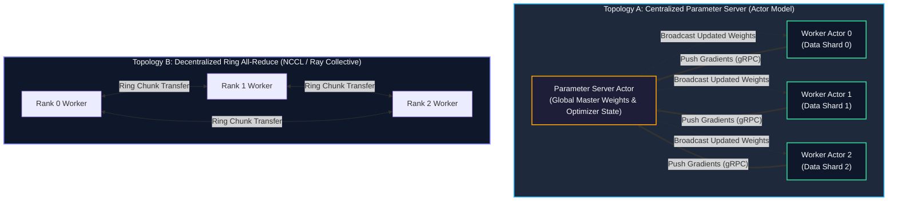
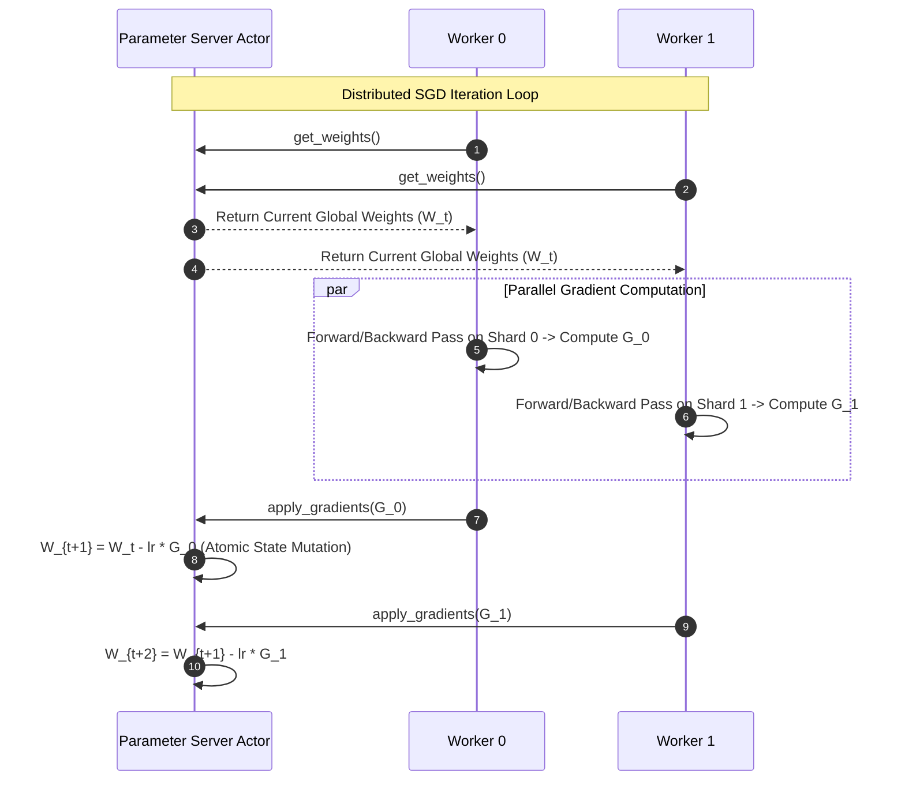

# Chapter 09: Distributed Machine Learning from Scratch

<div class="grid cards" markdown>

-   :material-school: **Topic Focus** &bull; Distributed Gradient Descent, Parameter Servers, Ring All-Reduce, and Worker Sharding
-   :material-play-circle: **Interactive Challenges** &bull; 4 Hands-on Exercises
-   :material-rocket-launch: [**Launch Playground in Wasm →**](../playground/index.html?chapter=9){ .md-button .md-button--primary }

</div>

---

## 1. Architectural Overview & Control Plane Mechanics

Building distributed ML frameworks requires coordinating workers across data parallelism architectures: **Parameter Server (PS)** models for centralized gradient aggregation, and **Ring All-Reduce** for decentralized peer-to-peer weight synchronization.





Ray tasks and actors provide the foundational primitives to implement custom distributed optimization routines, asynchronous SGD, and collective communication loops without low-level C++ MPI dependencies.

---

## 2. Annotated Python Code Anatomy & API Reference

```python
import ray
import numpy as np

# 1. Parameter Server Actor managing global model weights
@ray.remote
class ParameterServer:
    def __init__(self, num_features: int, lr: float = 0.01):
        self.weights = np.zeros(num_features, dtype=np.float32)
        self.lr = lr

    def apply_gradients(self, grads: np.ndarray) -> np.ndarray:
        self.weights -= self.lr * grads
        return self.weights

    def get_weights(self) -> np.ndarray:
        return self.weights

# 2. Worker Actors computing local gradients on data shards
@ray.remote
class DataParallelWorker:
    def __init__(self, worker_id: int, shard: np.ndarray):
        self.worker_id = worker_id
        self.shard = shard

    def compute_gradient(self, current_weights: np.ndarray) -> np.ndarray:
        # Simulated gradient step: X.T @ (X @ w - y)
        predictions = self.shard @ current_weights
        grads = np.mean(self.shard * predictions[:, None], axis=0)
        return grads
```

---

## 3. Production Best Practices & Hardening Guidelines

1. **Use Asynchronous SGD for Heterogeneous Clusters**: If some worker nodes are slower than others, use asynchronous gradient updates to prevent stragglers from stalling the step.
2. **Compress Gradient Transfers**: Quantize float32 gradients to float16 or int8 before transmission to reduce network communication bottlenecks.
3. **Double Buffer Data Loading**: Overlap gradient computation with batch pre-fetching from local shared memory.
4. **Partition Parameter Servers**: For models with billions of parameters, shard the parameter server across multiple actor instances.
5. **Decentralize with All-Reduce for Large Models**: For dense transformer architectures, use collective Ring All-Reduce communication over Parameter Servers.

---

## 4. Troubleshooting & Diagnostic Workflows

1. **Gradient Staleness in Async SGD**:
   - *Symptom*: Model training diverges or loss oscillates wildly.
   - *Fix*: Apply gradient clipping and decay learning rates for stale updates computed on older weight versions.
2. **Worker Straggler Stalls**:
   - *Symptom*: High step latency in synchronous SGD.
   - *Fix*: Implement backup workers (drop the slowest 5% of gradient contributions in each step).
3. **Weight Drift across Replicas**:
   - *Symptom*: Discrepancies between worker loss values.
   - *Fix*: Ensure random seeds are synchronized and weights are periodically re-broadcast from the root server.

---

## 5. Hands-on Practice Exercises

| Exercise ID | Goal / Topic | Playground Link |
| :--- | :--- | :--- |
| `ml_scratch01` | Distributed Parameter Server | [**Open Exercise ml_scratch01 →**](../playground/index.html?exercise=ml_scratch01) |
| `ml_scratch02` | Async vs Sync Gradient Averaging | [**Open Exercise ml_scratch02 →**](../playground/index.html?exercise=ml_scratch02) |
| `ml_scratch03` | Ring All-Reduce Implementation | [**Open Exercise ml_scratch03 →**](../playground/index.html?exercise=ml_scratch03) |
| `ml_scratch04` | Distributed Data-Parallel Trainer | [**Open Exercise ml_scratch04 →**](../playground/index.html?exercise=ml_scratch04) |
