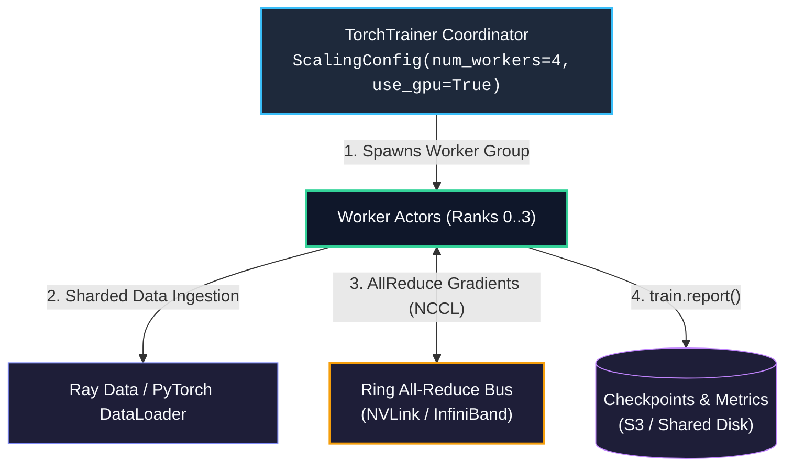

# Chapter 10: Distributed PyTorch Training with Ray Train

<div class="grid cards" markdown>

-   :material-school: **Topic Focus** &bull; Ray Train, `TorchTrainer`, DistributedDataParallel (DDP), and Checkpointing
-   :material-play-circle: **Interactive Challenges** &bull; 4 Hands-on Exercises
-   :material-rocket-launch: [**Launch Playground in Wasm →**](../playground/index.html?chapter=10){ .md-button .md-button--primary }

</div>

---

## 1. Architectural Overview & Control Plane Mechanics

**Ray Train** coordinates multi-node distributed training for PyTorch, TensorFlow, and XGBoost. It abstracts away environment variable setup (`MASTER_ADDR`, `MASTER_PORT`, `RANK`, `WORLD_SIZE`) and manages worker lifecycle and fault-tolerant checkpointing.



> **Diagram Walkthrough & Core Concepts:**
> - **Orchestrated Worker Groups**: `TorchTrainer` creates and manages a synchronized gang of training actors across cluster GPU nodes according to `ScalingConfig`.
> - **Automated Rendezvous & NCCL Rings**: Ray initializes the distributed PyTorch backend (master address, rank, world size) and coordinates high-speed peer-to-peer gradient synchronization via NCCL.
> - **Fault-Tolerant Checkpoint Reporting**: Workers report training metrics and save model checkpoints to cloud/local storage using `ray.train.report()`, enabling automatic failure recovery.

---

## 2. Annotated Python Code Anatomy & API Reference

```python
import ray
from ray import train
from ray.train import ScalingConfig
from ray.train.torch import TorchTrainer, TorchConfig

# 1. Define standard PyTorch distributed training function
def train_loop_per_worker(config: dict):
    import torch
    import torch.nn as nn
    
    # Model definition
    model = nn.Linear(10, 1)
    # Prepare model and optimizer for distributed DDP
    model = train.torch.prepare_model(model)
    optimizer = torch.optim.SGD(model.parameters(), lr=config.get("lr", 0.01))
    
    for epoch in range(config.get("epochs", 5)):
        inputs = torch.randn(32, 10)
        labels = torch.randn(32, 1)
        
        optimizer.zero_grad()
        loss = nn.functional.mse_loss(model(inputs), labels)
        loss.backward()
        optimizer.step()
        
        # Report metrics to Ray Train controller
        train.report({"loss": loss.item(), "epoch": epoch})

# 2. Configure multi-worker scaling
trainer = TorchTrainer(
    train_loop_per_worker=train_loop_per_worker,
    train_loop_config={"lr": 0.005, "epochs": 3},
    torch_config=TorchConfig(backend="gloo"),  # Or "nccl" on GPU clusters
    scaling_config=ScalingConfig(num_workers=2, use_gpu=False)
)

# 3. Execute training run
results = trainer.fit()
print(f"Final training loss: {results.metrics['loss']}")
```

---

## 3. Production Best Practices & Hardening Guidelines

1. **Use NCCL for Multi-GPU Runs**: Always specify `TorchConfig(backend="nccl")` on CUDA clusters for high-bandwidth NVLink communication.
2. **Shard Data with `prepare_data_loader`**: Wrap PyTorch DataLoaders with `train.torch.prepare_data_loader()` to automatically shard batches across ranks without overlap.
3. **Persist Distributed Checkpoints**: Save checkpoints via `train.report(metrics, checkpoint=Checkpoint.from_directory(...))` for automatic cloud storage sync.
4. **Tune Worker CPU Allocation**: Set `resources_per_worker={"CPU": 4, "GPU": 1}` in `ScalingConfig` to provide adequate CPU cores for data loading.
5. **Enable Elastic Worker Recovery**: Configure `RunConfig(failure_config=FailureConfig(max_failures=3))` to survive spot instance preemptions.

---

## 4. Troubleshooting & Diagnostic Workflows

1. **NCCL Timeout / Hang during All-Reduce**:
   - *Symptom*: Training hangs indefinitely at the end of epoch 1.
   - *Fix*: Check that all ranks execute the exact same number of training batches; uneven datasets cause trailing ranks to block waiting for peers.
2. **CUDA Device Mismatch**:
   - *Symptom*: `RuntimeError: Expected all tensors to be on the same device`.
   - *Fix*: Use `train.torch.get_device()` to ensure inputs and models share the rank's designated GPU.
3. **Storage Sync Bottleneck**:
   - *Symptom*: High pause time after `train.report()`.
   - *Fix*: Exclude optimizer states from validation-only checkpoints or save asynchronously.

---

## 5. Hands-on Practice Exercises

| Exercise ID | Goal / Topic | Playground Link |
| :--- | :--- | :--- |
| `train01` | PyTorch TorchTrainer & ScalingConfig | [**Open Exercise train01 →**](../playground/index.html?exercise=train01) |
| `train02` | Distributed DataLoader via DataConfig | [**Open Exercise train02 →**](../playground/index.html?exercise=train02) |
| `train03` | Multi-Worker Gradient Sync & Metrics | [**Open Exercise train03 →**](../playground/index.html?exercise=train03) |
| `train04` | Distributed Checkpointing & Fault Recovery | [**Open Exercise train04 →**](../playground/index.html?exercise=train04) |
