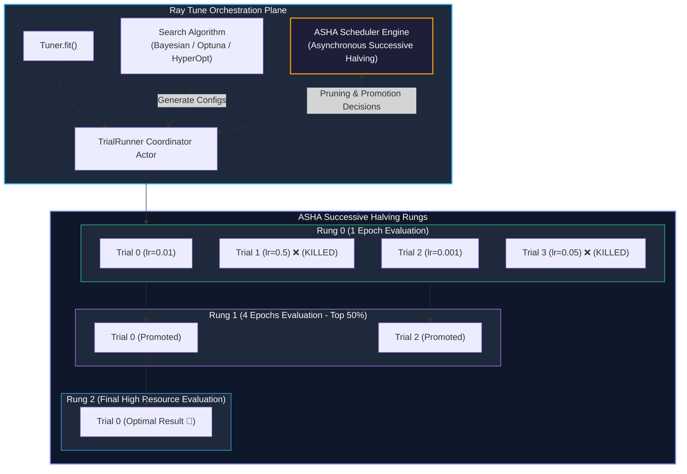
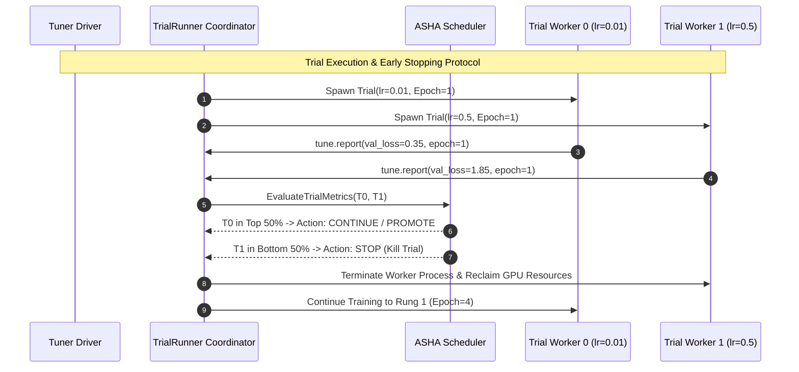

# Chapter 11: Hyperparameter Optimization with Ray Tune & ASHA

<div class="grid cards" markdown>

-   :material-school: **Topic Focus** &bull; Ray Tune, Search Spaces, ASHA Early-Stopping Schedulers, and Bayesian Optimization
-   :material-play-circle: **Interactive Challenges** &bull; 3 Hands-on Exercises
-   :material-rocket-launch: [**Launch Playground in Wasm →**](../playground/index.html?chapter=11){ .md-button .md-button--primary }

</div>

---

## 1. Architectural Overview & Control Plane Mechanics

**Ray Tune** executes scalable, distributed hyperparameter search across hundreds of concurrent trials. It couples state-of-the-art search algorithms (Bayesian, Optuna, HyperOpt) with early-stopping trial schedulers like **ASHA (Asynchronous Successive Halving Algorithm)**.





ASHA dynamically prunes underperforming configurations early in their training trajectory, freeing node CPU/GPU slots to evaluate new configurations asynchronously.

---

## 2. Annotated Python Code Anatomy & API Reference

```python
import ray
from ray import tune
from ray.tune.schedulers import ASHAScheduler

# 1. Define objective function
def evaluation_objective(config: dict):
    lr = config["lr"]
    momentum = config["momentum"]
    
    for epoch in range(10):
        # Simulated validation loss curve
        val_loss = (1.0 - (lr * 10)) ** 2 + (0.5 - momentum) ** 2 + (1.0 / (epoch + 1))
        # Report metric to Tune scheduler
        tune.report({"val_loss": val_loss, "epoch": epoch})

# 2. Define search space and ASHA early-stopping scheduler
search_space = {
    "lr": tune.loguniform(1e-4, 1e-1),
    "momentum": tune.uniform(0.1, 0.9),
}

scheduler = ASHAScheduler(
    metric="val_loss",
    mode="min",
    max_t=10,
    grace_period=2,
    reduction_factor=3
)

# 3. Launch tuner
tuner = tune.Tuner(
    evaluation_objective,
    param_space=search_space,
    tune_config=tune.TuneConfig(num_samples=20, scheduler=scheduler)
)
results = tuner.fit()
best_result = results.get_best_result(metric="val_loss", mode="min")
print(f"Best config: {best_result.config} | Loss: {best_result.metrics['val_loss']}")
```

---

## 3. Production Best Practices & Hardening Guidelines

1. **Use ASHA for Iterative Deep Learning**: ASHA outperforms random and grid search by 5–10x by aggressively terminating unpromising trials.
2. **Define Log-Uniform Spaces for Learning Rates**: Use `tune.loguniform(min, max)` rather than linear uniform for parameters spanning multiple orders of magnitude.
3. **Limit Max Concurrent Trials**: Set `tune.TuneConfig(max_concurrent_trials=N)` to prevent overloading available cluster GPU slots.
4. **Use Checkpoints for Early Stopping & Resuming**: Save trial state with `train.report(..., checkpoint=...)` to allow paused trials to resume.
5. **Track Experiments with MLflow / Wandb**: Attach `WandbLoggerCallback` or `MLflowLoggerCallback` to `tune.Tuner(run_config=...)`.

---

## 4. Troubleshooting & Diagnostic Workflows

1. **Trials Terminating Immediately with Error**:
   - *Symptom*: All trials fail on step 0.
   - *Fix*: Check trial error logs in `results.errors`; verify input data path is accessible to all worker nodes.
2. **Scheduler Metric Direction Inverted**:
   - *Symptom*: Best trial selected has highest loss instead of lowest.
   - *Fix*: Verify `mode="min"` for loss minimization or `mode="max"` for accuracy metrics.
3. **Resource Starvation**:
   - *Symptom*: Only 1 trial runs at a time.
   - *Fix*: Check trial resource requests in `tune.with_resources(objective, {"cpu": 1, "gpu": 0.5})`.

---

## 5. Hands-on Practice Exercises

| Exercise ID | Goal / Topic | Playground Link |
| :--- | :--- | :--- |
| `tune01` | Tune Search Spaces & Distributed Trials | [**Open Exercise tune01 →**](../playground/index.html?exercise=tune01) |
| `tune02` | ASHA / HyperBand Schedulers | [**Open Exercise tune02 →**](../playground/index.html?exercise=tune02) |
| `tune03` | Population-Based Training (PBT) | [**Open Exercise tune03 →**](../playground/index.html?exercise=tune03) |
