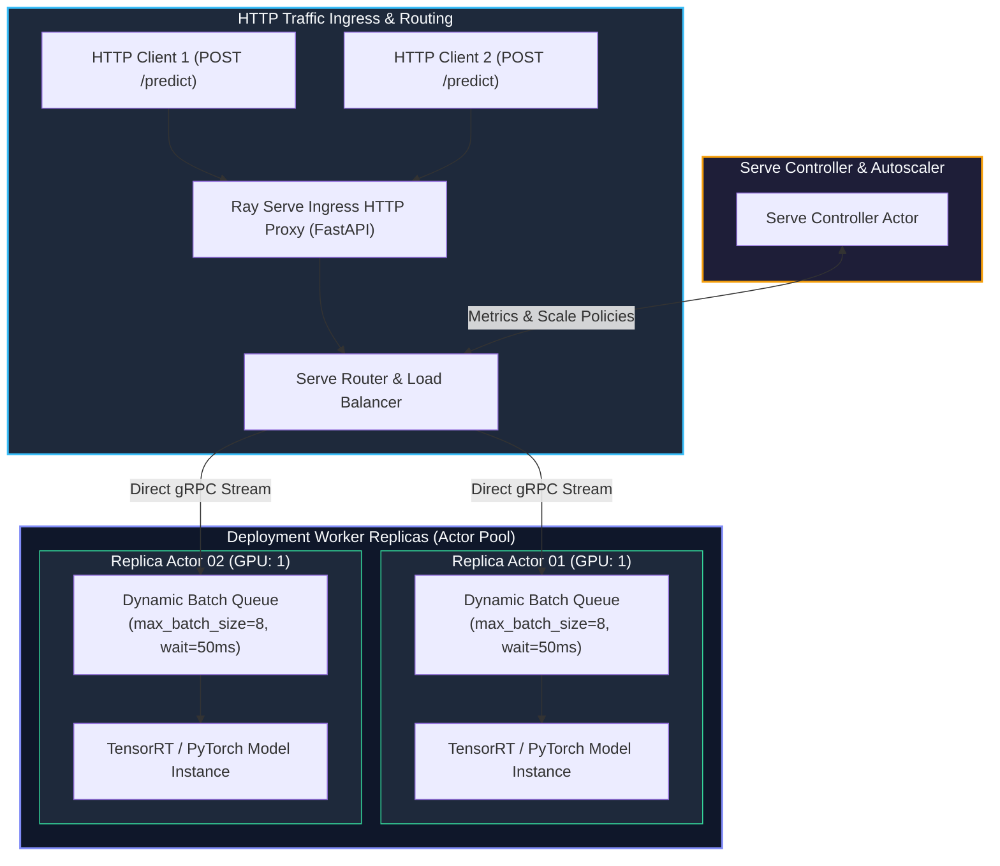
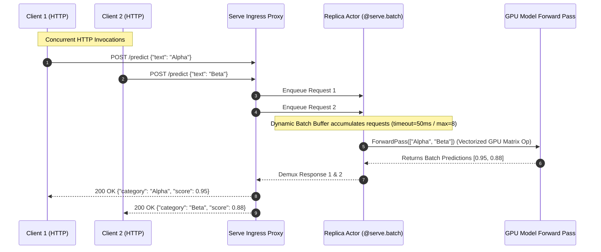

# Chapter 12: Production Model Serving & Autoscaling with Ray Serve

<div class="grid cards" markdown>

-   :material-school: **Topic Focus** &bull; Ray Serve, `@serve.deployment`, HTTP Ingress, Dynamic Batching, and Autoscaling
-   :material-play-circle: **Interactive Challenges** &bull; 5 Hands-on Exercises
-   :material-rocket-launch: [**Launch Playground in Wasm →**](../playground/index.html?chapter=12){ .md-button .md-button--primary }

</div>

---

## 1. Architectural Overview & Control Plane Mechanics

**Ray Serve** is a scalable model serving framework designed for complex inference pipelines (combining LLMs, embedding models, and business logic). Serve manages HTTP ingress routers, dynamic request batching, model multiplexing, and replica autoscaling.





Serve decouples HTTP routing from model execution, automatically queuing and packing concurrent requests into optimal GPU micro-batches. The Serve Controller monitors request latency and queue backlogs to scale replica actor pools horizontally.

---

## 2. Annotated Python Code Anatomy & API Reference

```python
import ray
from ray import serve
from fastapi import FastAPI

app = FastAPI()

@serve.deployment(num_replicas=2, ray_actor_options={"num_cpus": 1})
@serve.ingress(app)
class ClassifierDeployment:
    def __init__(self):
        # Load heavy model weights once during replica startup
        self.categories = ["finance", "tech", "health"]

    @app.get("/predict")
    def predict(self, text: str) -> dict:
        category = self.categories[len(text) % len(self.categories)]
        return {"input": text, "category": category, "confidence": 0.95}

    @serve.batch(max_batch_size=8, batch_wait_timeout_s=0.05)
    async def dynamic_batch_predict(self, texts: list[str]) -> list[str]:
        # Micro-batching multiple concurrent HTTP requests into one matrix op
        return [self.categories[len(t) % len(self.categories)] for t in texts]

# Build the deployment handle
entrypoint = ClassifierDeployment.bind()
```

---

## 3. Production Best Practices & Hardening Guidelines

1. **Use `@serve.batch` for GPU Acceleration**: Dynamic batching aggregates requests across concurrent users, boosting GPU inference throughput by 5–10x.
2. **Configure Multi-Stage Pipeline Graphs**: Connect deployments using `DeploymentHandle` rather than making internal HTTP roundtrips.
3. **Set Autoscaling Target Queue Depths**: Configure `autoscaling_config={"target_ongoing_requests": 5, "min_replicas": 1, "max_replicas": 10}`.
4. **Use Model Multiplexing for Multiple LoRA Adapters**: Serve thousands of fine-tuned adapter weights on a single base model pool using `serve.multiplex`.
5. **Implement Health Checks**: Define `check_health()` methods on deployments to allow Serve to restart unresponsive worker replicas.

---

## 4. Troubleshooting & Diagnostic Workflows

1. **High Ingress Latency / Queue Stalls**:
   - *Symptom*: Request timeouts under load.
   - *Fix*: Decrease `batch_wait_timeout_s` or increase `max_replicas` in the autoscaling configuration.
2. **Replica Crash on Startup**:
   - *Symptom*: Serve deployment status shows `DEPLOY_FAILED`.
   - *Fix*: Check replica logs for missing GPU drivers or weights download failure during `__init__`.
3. **Cross-Replica State Leak**:
   - *Symptom*: User data appears in subsequent requests.
   - *Fix*: Avoid storing per-request state on `self` in deployment classes; use local variables inside request handler functions.

---

## 5. Hands-on Practice Exercises

| Exercise ID | Goal / Topic | Playground Link |
| :--- | :--- | :--- |
| `serve01` | Ray Serve Deployments & HTTP Ingress | [**Open Exercise serve01 →**](../playground/index.html?exercise=serve01) |
| `serve02` | Dynamic Request Batching (@serve.batch) | [**Open Exercise serve02 →**](../playground/index.html?exercise=serve02) |
| `serve03` | Multi-Model Composable Pipelines (DAGs) | [**Open Exercise serve03 →**](../playground/index.html?exercise=serve03) |
| `serve04` | Streaming Responses with FastApi & Generators | [**Open Exercise serve04 →**](../playground/index.html?exercise=serve04) |
| `serve05` | Serve Autoscaling Policies | [**Open Exercise serve05 →**](../playground/index.html?exercise=serve05) |
