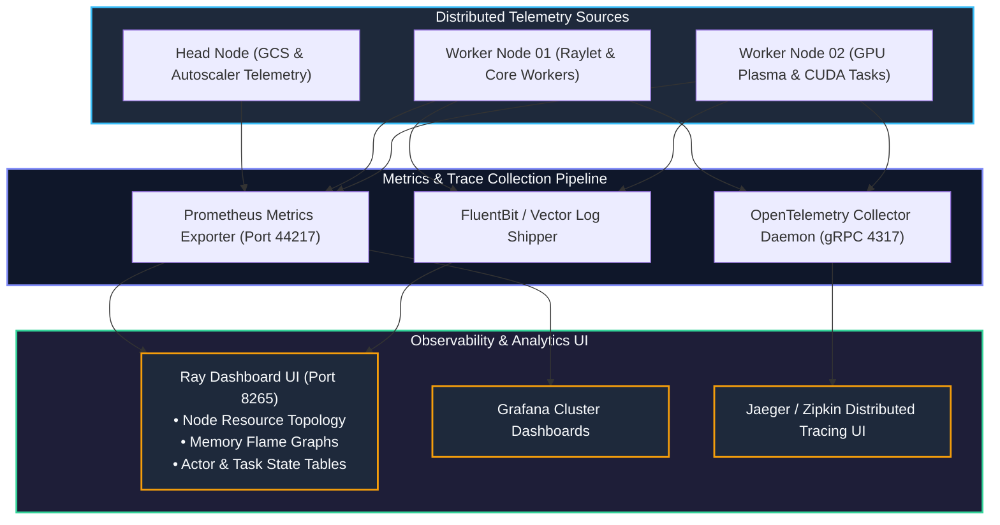
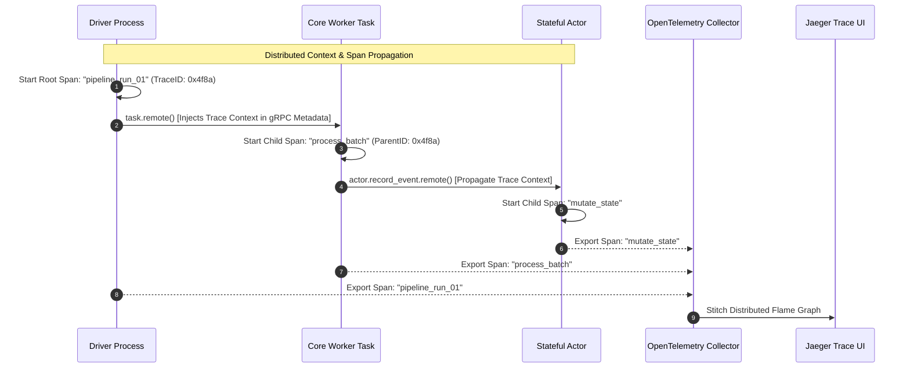

# Chapter 13: Production Observability, Profiling & Tracing

<div class="grid cards" markdown>

-   :material-school: **Topic Focus** &bull; Ray Dashboard, OpenTelemetry Tracing, Distributed Profiling, and Performance Diagnostics
-   :material-play-circle: **Interactive Challenges** &bull; 3 Hands-on Exercises
-   :material-rocket-launch: [**Launch Playground in Wasm →**](../playground/index.html?chapter=13){ .md-button .md-button--primary }

</div>

---

## 1. Architectural Overview & Control Plane Mechanics

Operating Ray in production requires unified visibility into CPU/GPU utilization, object store memory allocation, task execution timelines, and distributed traces.





Ray exports native Prometheus metrics (queue depth, memory spilling, active actors) and integrates with OpenTelemetry for end-to-end distributed span tracing.

---

## 2. Annotated Python Code Anatomy & API Reference

```python
import ray
from ray.util import tracing

# 1. Initialize Ray with OpenTelemetry tracing integration
ray.init(
    _tracing_startup_hook="ray.util.tracing.setup_type:setup_tracing",
    ignore_reinit_error=True
)

# 2. Trace custom task spans with tracing API
@ray.remote
def monitored_etl_task(batch_id: int) -> dict:
    # Custom tracing span within the distributed worker
    tracer = tracing.get_tracer(__name__)
    with tracer.start_as_current_span("compute_metrics"):
        result = sum(i * i for i in range(100000))
    return {"batch_id": batch_id, "result": result}

# 3. Retrieve cluster memory telemetry
from ray.util.state import summarize_objects
object_summary = summarize_objects()
print(f"Total active objects in memory: {object_summary.get('total_objects', 0)}")
```

---

## 3. Production Best Practices & Hardening Guidelines

1. **Scrape Prometheus Metrics at `/metrics`**: Configure Prometheus to scrape node `raylet` daemons on port 9090 for cluster-wide alerts.
2. **Profile Hot Tasks with Ray Timeline**: Export Chrome tracing JSON via `ray.timeline(filename="timeline.json")` to identify CPU idle gaps.
3. **Trace Cross-Service Inference with OpenTelemetry**: Propagate trace contexts across Ray Serve deployments and downstream databases.
4. **Alert on High Object Spilling**: Set alerts when `ray_object_store_memory{type="spilled"}` increases rapidly.
5. **Monitor GCS Storage Memory**: Track GCS memory usage to prevent metadata thrashing on high-churn clusters.

---

## 4. Troubleshooting & Diagnostic Workflows

1. **High GC Pause Latency**:
   - *Symptom*: Spikes in task execution latency visible on Ray Dashboard flame charts.
   - *Fix*: Enable `py-spy` profiler via Ray Dashboard to inspect Python GIL contention and memory allocation hotspots.
2. **Missing Distributed Traces**:
   - *Symptom*: OTel spans dropped between actor calls.
   - *Fix*: Ensure OpenTelemetry SDK is installed across all cluster worker images and `OTEL_EXPORTER_OTLP_ENDPOINT` is configured.
3. **Dashboard Unresponsive under Heavy Load**:
   - *Symptom*: Dashboard port 8265 times out during 10,000+ task submissions.
   - *Fix*: Increase Dashboard agent scrape interval or use CLI state APIs (`ray summary tasks`).

---

## 5. Hands-on Practice Exercises

| Exercise ID | Goal / Topic | Playground Link |
| :--- | :--- | :--- |
| `perf01` | Ray Execution Profiling & Chrome Timelines | [**Open Exercise perf01 →**](../playground/index.html?exercise=perf01) |
| `perf02` | Diagnosing Memory Leaks with ray memory | [**Open Exercise perf02 →**](../playground/index.html?exercise=perf02) |
| `perf03` | Ray Metrics & Prometheus Exports | [**Open Exercise perf03 →**](../playground/index.html?exercise=perf03) |
