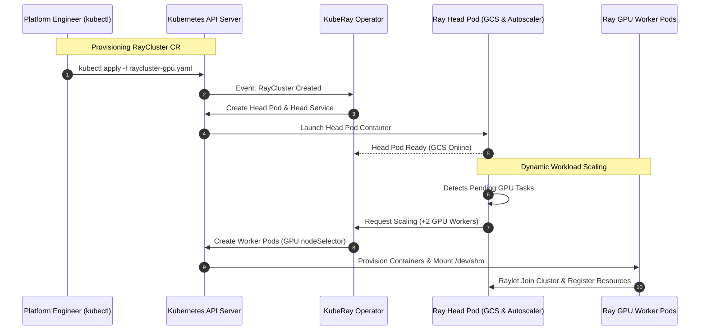

# Chapter 14: Kubernetes Native Distributed AI with KubeRay Operators

<div class="grid cards" markdown>

-   :material-school: **Topic Focus** &bull; KubeRay Operator, `RayCluster`, `RayJob`, `RayService`, and Cloud Native Auto-scaling
-   :material-play-circle: **Interactive Challenges** &bull; 5 Hands-on Exercises
-   :material-rocket-launch: [**Launch Playground in Wasm →**](../playground/index.html?chapter=14){ .md-button .md-button--primary }

</div>

---

## 1. Architectural Overview & Control Plane Mechanics

**KubeRay** is the official Kubernetes operator for orchestrating Ray clusters on top of cloud-native infrastructure. KubeRay manages three primary Custom Resource Definitions (CRDs):

```mermaid
flowchart TD
    subgraph K8sControlPlane["Kubernetes Control Plane"]
        APIServer["Kubernetes API Server (etcd)"]
        Operator["KubeRay Operator Controller Pod<br/>(Watches CRDs & Reconciles State)"]
        APIServer <-->|"Watch / Reconcile Events"| Operator
    end

    subgraph CustomResources["KubeRay Custom Resource Definitions (CRDs)"]
        CR_Cluster["RayCluster CR"]
        CR_Job["RayJob CR (Ephemeral Workloads)"]
        CR_Service["RayService CR (Zero-Downtime Serving)"]
    end

    subgraph PodTopology["Kubernetes Cluster Pod Topology"]
        subgraph HeadGroup["Head Pod Group"]
            HeadPod["Ray Head Pod<br/>• GCS Server<br/>• Ray Autoscaler<br/>• Ray Dashboard (Service: 8265)"]
        end

        subgraph WorkerGroups["Worker Pod Groups (Daemon / Deployment)"]
            CPU_Pods["CPU Worker Pod Group<br/>• /dev/shm (emptyDir Memory)<br/>• Raylet Daemon"]
            GPU_Pods["GPU Worker Pod Group (Spot / On-Demand)<br/>• NVIDIA GPU Device Plugin<br/>• Raylet Daemon"]
        end
    end

    Operator --> CustomResources
    CR_Cluster --> HeadPod
    CR_Cluster --> WorkerGroups
    HeadPod <==|"Cluster Autoscaler Scale Requests"| Operator

    style K8sControlPlane fill:#1e293b,stroke:#38bdf8,stroke-width:2px,color:#f8fafc
    style CustomResources fill:#0f172a,stroke:#818cf8,stroke-width:2px,color:#f8fafc
    style PodTopology fill:#1e1e38,stroke:#34d399,stroke-width:2px,color:#f8fafc
    style HeadPod fill:#1e293b,stroke:#f59e0b,stroke-width:2px,color:#f8fafc
    style CPU_Pods fill:#0f172a,stroke:#38bdf8,stroke-width:1px,color:#f8fafc
    style GPU_Pods fill:#0f172a,stroke:#c084fc,stroke-width:1px,color:#f8fafc
```



KubeRay reconciles Kubernetes Pod lifecycle events with Ray GCS cluster status, managing GPU pod groups, spot instance tolerations, and shared memory volume mounts (`/dev/shm`).

---

## 2. Annotated YAML Anatomy & Schema Reference

```yaml
apiVersion: ray.io/v1
kind: RayCluster
metadata:
  name: raycluster-gpu-prod
  namespace: ray-system
spec:
  rayVersion: '2.40.0'
  headGroupSpec:
    rayStartParams:
      dashboard-host: '0.0.0.0'
    template:
      spec:
        containers:
        - name: ray-head
          image: rayproject/ray:2.40.0-py312
          resources:
            limits:
              cpu: "4"
              memory: "16Gi"
            requests:
              cpu: "2"
              memory: "8Gi"
  workerGroupSpecs:
  - groupName: gpu-group
    replicas: 2
    minReplicas: 1
    maxReplicas: 8
    rayStartParams: {}
    template:
      spec:
        containers:
        - name: ray-worker
          image: rayproject/ray:2.40.0-py312-gpu
          resources:
            limits:
              nvidia.com/gpu: "1"
              memory: "32Gi"
```

### Key CRD Specification Reference

- **`RayCluster`**: Manages underlying Head Pod, Worker Pod groups, and autoscaling.
- **`RayJob`**: Submits a batch job, creates a transient RayCluster, runs the driver to completion, and cleans up resources.
- **`RayService`**: Manages a high-availability Ray Serve deployment with zero-downtime rolling cluster upgrades.

---

## 3. Production Best Practices & Hardening Guidelines

1. **Mount Shared Memory to `/dev/shm`**: Always mount an `emptyDir` with `medium: Memory` to `/dev/shm` in worker pod specs to enable Plasma zero-copy performance.
2. **Use Separate Head & Worker Node Pools**: Run Head Pods on stable CPU nodes with non-preemptible capacity; run Worker Pods on GPU spot instance nodepools.
3. **Configure Service Mesh / Network Policies**: Secure inter-pod communication and expose the Dashboard only via authenticated ingress.
4. **Tune Autoscaler Upscaling Speed**: Configure `upscalingMode: Default` and set conservative downscale delay windows to prevent thrashing during multi-stage training runs.
5. **Use RayJob for Batch Training**: Package ML training runs as `RayJob` manifests for reproducible CI/CD execution.

---

## 4. Troubleshooting & Diagnostic Workflows

1. **Plasma `/dev/shm` Full on Worker Pods**:
   - *Symptom*: Worker pods evicted with `OOMKilled` or `DiskFull`.
   - *Fix*: Verify `volumeMounts` mounts `emptyDir: { medium: Memory }` to `/dev/shm` with appropriate size limit.
2. **Worker Pod Fails to Join GCS**:
   - *Symptom*: Worker pods enter `Running` state but do not register in `ray.nodes()`.
   - *Fix*: Check DNS resolution of Head Service (`raycluster-head-svc`) and port 6379 connectivity.
3. **RayService Rollout Stuck**:
   - *Symptom*: New cluster created but traffic never shifts to the updated deployment.
   - *Fix*: Check Serve application health checks; verify model weights download succeeds in the new replica pods.

---

## 5. Hands-on Practice Exercises

| Exercise ID | Goal / Topic | Playground Link |
| :--- | :--- | :--- |
| `kuberay01` | RayCluster Custom Resource (CRD) | [**Open Exercise kuberay01 →**](../playground/index.html?exercise=kuberay01) |
| `kuberay02` | RayJob CRD & Batch Job Lifecycle | [**Open Exercise kuberay02 →**](../playground/index.html?exercise=kuberay02) |
| `kuberay03` | RayService CRD & Zero-Downtime Serving | [**Open Exercise kuberay03 →**](../playground/index.html?exercise=kuberay03) |
| `kuberay04` | Autoscaling with KEDA & Ray Autoscaler | [**Open Exercise kuberay04 →**](../playground/index.html?exercise=kuberay04) |
| `kuberay05` | Kubernetes Fault Tolerance & Pod Evictions | [**Open Exercise kuberay05 →**](../playground/index.html?exercise=kuberay05) |
