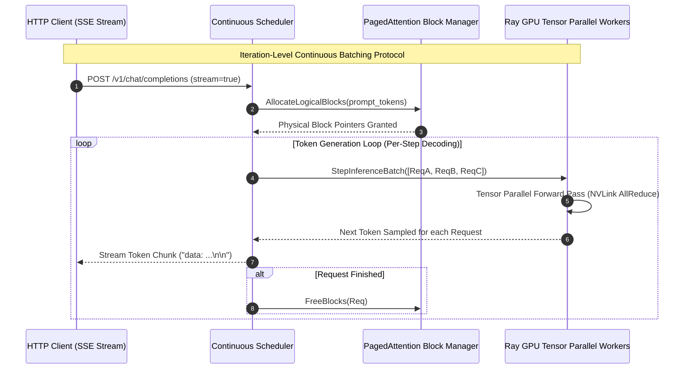

# Chapter 15: High-Throughput LLM Serving with vLLM & PagedAttention

<div class="grid cards" markdown>

-   :material-school: **Topic Focus** &bull; vLLM Engine, PagedAttention, Continuous Batching, and Tensor Parallelism
-   :material-play-circle: **Interactive Challenges** &bull; 4 Hands-on Exercises
-   :material-rocket-launch: [**Launch Playground in Wasm →**](../playground/index.html?chapter=15){ .md-button .md-button--primary }

</div>

---

## 1. Architectural Overview & Control Plane Mechanics

Serving Large Language Models (LLMs) requires extreme GPU memory bandwidth and efficient Key-Value (KV) cache management. **vLLM** introduces **PagedAttention**, which manages KV cache memory like virtual memory pages in operating systems, eliminating internal memory fragmentation.

```mermaid
flowchart TD
    subgraph ClientRequests["Streaming Token Ingestion"]
        ReqA["User Prompt A (Length: 512)"] --> Scheduler["Continuous Iteration-Level Scheduler"]
        ReqB["User Prompt B (Length: 128)"] --> Scheduler
        ReqC["User Prompt C (Length: 1024)"] --> Scheduler
    end

    subgraph MemoryManagement["PagedAttention Memory Subsystem"]
        Scheduler <--> BlockTable["Logical Block Table (Virtual KV Cache Pages)"]
        BlockTable <--> PhysMem["Non-Contiguous GPU HBM Memory Blocks (Zero Waste)"]
    end

    subgraph TensorParallelism["Ray Tensor Parallel (TP) GPU Actor Pool"]
        subgraph GPU0["Ray Actor Rank 0 (NVIDIA H100)"]
            ShardedLayer0["Sharded Attention Head Q/K/V 0..N/2"]
        end

        subgraph GPU1["Ray Actor Rank 1 (NVIDIA H100)"]
            ShardedLayer1["Sharded Attention Head Q/K/V N/2..N"]
        end

        GPU0 <==|"High-Speed NVLink AllGather / ReduceScatter"| GPU1
    end

    PhysMem --> GPU0
    PhysMem --> GPU1
    GPU0 --> StreamEngine["Token Stream Output (SSE / WebSocket)"]

    style ClientRequests fill:#1e293b,stroke:#38bdf8,stroke-width:2px,color:#f8fafc
    style MemoryManagement fill:#0f172a,stroke:#818cf8,stroke-width:2px,color:#f8fafc
    style TensorParallelism fill:#1e1e38,stroke:#34d399,stroke-width:2px,color:#f8fafc
    style GPU0 fill:#0f172a,stroke:#c084fc,stroke-width:1px,color:#f8fafc
    style GPU1 fill:#0f172a,stroke:#c084fc,stroke-width:1px,color:#f8fafc
    style StreamEngine fill:#1e293b,stroke:#f59e0b,stroke-width:2px,color:#f8fafc
```



Integrated with Ray, vLLM scales across multiple GPUs using Ray actors as Tensor Parallel workers, dynamically batching arriving requests at the token level (continuous batching) and eliminating KV cache memory fragmentation via PagedAttention.

---

## 2. Annotated Python Code Anatomy & API Reference

```python
import ray
from typing import AsyncGenerator

# 1. Define high-throughput LLM actor engine
@ray.remote(num_gpus=1)
class LLMInferenceEngine:
    def __init__(self, model_name: str):
        self.model_name = model_name
        # In real clusters: from vllm import AsyncLLMEngine, SamplingParams
        print(f"Initialized vLLM engine for {model_name} with PagedAttention")

    async def generate_stream(self, prompt: str, max_tokens: int = 128) -> AsyncGenerator[str, None]:
        """Simulates token-by-token streaming response."""
        words = prompt.split() + ["is", "processed", "efficiently", "via", "Ray", "vLLM."]
        for w in words[:max_tokens]:
            yield w + " "

# 2. Deploy engine and stream tokens
engine = LLMInferenceEngine.remote("meta-llama/Llama-3-8B-Instruct")
```

---

## 3. Production Best Practices & Hardening Guidelines

1. **Enable Continuous Batching**: Continuous iteration-level batching provides up to 20x higher request throughput compared to naive static batching.
2. **Tune `gpu_memory_utilization`**: Set `gpu_memory_utilization=0.90` to maximize space allocated to KV cache pages while avoiding CUDA out-of-memory errors.
3. **Use Tensor Parallelism across NVLink**: Set `tensor_parallel_size=2|4|8` on single nodes with high-speed NVLink interconnects.
4. **Implement Speculative Decoding**: Pair a small draft model with a large target model to accelerate token generation latency by 1.5–2.5x.
5. **Stream Tokens via Server-Sent Events (SSE)**: Expose token generation via asynchronous generators to provide real-time UI streaming to clients.

---

## 4. Troubleshooting & Diagnostic Workflows

1. **CUDA Out of Memory (OOM) during Request Spikes**:
   - *Symptom*: Engine crashes with `torch.cuda.OutOfMemoryError`.
   - *Fix*: Reduce `max_num_seqs` or lower `gpu_memory_utilization` in engine configuration.
2. **High Time-to-First-Token (TTFT)**:
   - *Symptom*: Initial response latency is high for long prompt contexts.
   - *Fix*: Enable chunked prefill (`enable_chunked_prefill=True`) to interleave prompt processing with token decoding.
3. **KV Cache Exhaustion Preemption**:
   - *Symptom*: Requests are paused or dropped with "KV cache full" warnings.
   - *Fix*: Increase available GPU memory, add worker nodes, or configure max context length limits (`max_model_len`).

---

## 5. Hands-on Practice Exercises

| Exercise ID | Goal / Topic | Playground Link |
| :--- | :--- | :--- |
| `vllm01` | Tensor Parallelism & Worker Actor Groups | [**Open Exercise vllm01 →**](../playground/index.html?exercise=vllm01) |
| `vllm02` | PagedAttention & KV-Cache Block Management | [**Open Exercise vllm02 →**](../playground/index.html?exercise=vllm02) |
| `vllm03` | Dynamic Multi-LoRA Adapter Serving | [**Open Exercise vllm03 →**](../playground/index.html?exercise=vllm03) |
| `vllm04` | Speculative Decoding with Draft & Target Workers | [**Open Exercise vllm04 →**](../playground/index.html?exercise=vllm04) |
