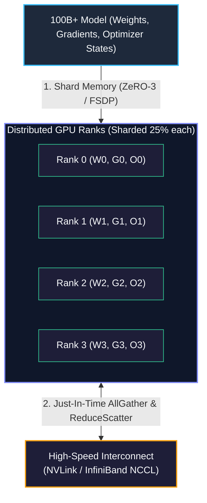

# Chapter 16: Multi-Node LLM Distributed Training (FSDP & DeepSpeed)

<div class="grid cards" markdown>

-   :material-school: **Topic Focus** &bull; Fully Sharded Data Parallel (FSDP), DeepSpeed ZeRO-3, Activation Checkpointing, and Multi-Node Scaling
-   :material-play-circle: **Interactive Challenges** &bull; 4 Hands-on Exercises
-   :material-rocket-launch: [**Launch Playground in Wasm →**](../playground/index.html?chapter=16){ .md-button .md-button--primary }

</div>

---

## 1. Architectural Overview & Control Plane Mechanics

Training billion-parameter foundation models exceeds the VRAM capacity of any single GPU. **Fully Sharded Data Parallel (FSDP)** and **DeepSpeed ZeRO-3** eliminate memory redundancy by sharding optimizer states, gradients, and model parameters across all distributed ranks.



> **Diagram Walkthrough & Core Concepts:**
> - **Zero Redundancy Memory Sharding**: FSDP and DeepSpeed ZeRO-3 partition model weights, gradients, and optimizer states evenly across all available GPU ranks instead of replicating them.
> - **Just-In-Time Layer All-Gather**: During forward computation, full layer weights are reconstructed dynamically on-the-fly via NCCL All-Gather and discarded immediately after activation calculation.
> - **Reduce-Scatter Gradient Aggregation**: In the backward pass, gradients are computed locally and synchronized using Reduce-Scatter, ensuring each GPU rank only holds and updates its assigned shard of the optimizer state.

---

## 2. Annotated Python Code Anatomy & API Reference

```python
import ray
from ray import train
from ray.train.torch import TorchTrainer, TorchConfig
from ray.train import ScalingConfig

def fsdp_train_loop_per_worker(config: dict):
    import torch
    import torch.nn as nn
    
    # In full environments: from torch.distributed.fsdp import FullyShardedDataParallel as FSDP
    model = nn.Sequential(
        nn.Linear(1024, 2048),
        nn.ReLU(),
        nn.Linear(2048, 1024)
    )
    
    # Wrap model with distributed training coordinator
    model = train.torch.prepare_model(model)
    optimizer = torch.optim.AdamW(model.parameters(), lr=1e-4)
    
    for step in range(config.get("steps", 5)):
        inputs = torch.randn(16, 1024)
        optimizer.zero_grad()
        loss = model(inputs).sum()
        loss.backward()
        optimizer.step()
        train.report({"loss": loss.item(), "step": step})

trainer = TorchTrainer(
    train_loop_per_worker=fsdp_train_loop_per_worker,
    scaling_config=ScalingConfig(num_workers=2, use_gpu=False)
)
```

---

## 3. Production Best Practices & Hardening Guidelines

1. **Enable Activation Checkpointing (Gradient Checkpointing)**: Discard intermediate activations during forward pass and recompute them during backward pass to save up to 70% VRAM.
2. **Use Mixed Precision (`torch.bfloat16`)**: Train in `bfloat16` to halve communication bandwidth and leverage Tensor Cores without underflow risks.
3. **Configure Backward Prefetching**: Set `backward_prefetch=BackwardPrefetch.BACKWARD_PRE` to overlap communication with backprop tensor calculations.
4. **Tune Auto-Wrapping Policy**: Wrap transformer blocks (e.g. `LlamaDecoderLayer`) with `transformer_auto_wrap_policy` for fine-grained sharding units.
5. **Set CPU Offloading for Giant Models**: Offload optimizer states to host RAM via `cpu_offload=CPUOffload(offload_params=True)` when model size exceeds aggregate GPU memory.

---

## 4. Troubleshooting & Diagnostic Workflows

1. **Slow Training Due to High All-Gather Overhead**:
   - *Symptom*: GPU compute utilization drops below 40% with high communication wait times.
   - *Fix*: Increase batch size per rank or group layers into larger wrapping units to reduce communication frequency.
2. **Checkpoint Save Memory Spike**:
   - *Symptom*: Node crashes during model saving due to CPU RAM exhaustion.
   - *Fix*: Use `StateDictType.SHARDED_STATE_DICT` so each rank writes only its local shard directly to storage.
3. **Loss Instability / NaN in Mixed Precision**:
   - *Symptom*: Loss turns to NaN during early training steps.
   - *Fix*: Apply gradient norm clipping (`torch.nn.utils.clip_grad_norm_(model.parameters(), 1.0)`).

---

## 5. Hands-on Practice Exercises

| Exercise ID | Goal / Topic | Playground Link |
| :--- | :--- | :--- |
| `fsdp01` | PyTorch FSDP with Ray Train ScalingConfig | [**Open Exercise fsdp01 →**](../playground/index.html?exercise=fsdp01) |
| `fsdp02` | DeepSpeed ZeRO-1 / ZeRO-2 / ZeRO-3 Memory Partitioning | [**Open Exercise fsdp02 →**](../playground/index.html?exercise=fsdp02) |
| `fsdp03` | Mixed Precision & Activation Checkpointing | [**Open Exercise fsdp03 →**](../playground/index.html?exercise=fsdp03) |
| `fsdp04` | Elastic Fault-Tolerant Distributed Checkpoints | [**Open Exercise fsdp04 →**](../playground/index.html?exercise=fsdp04) |
