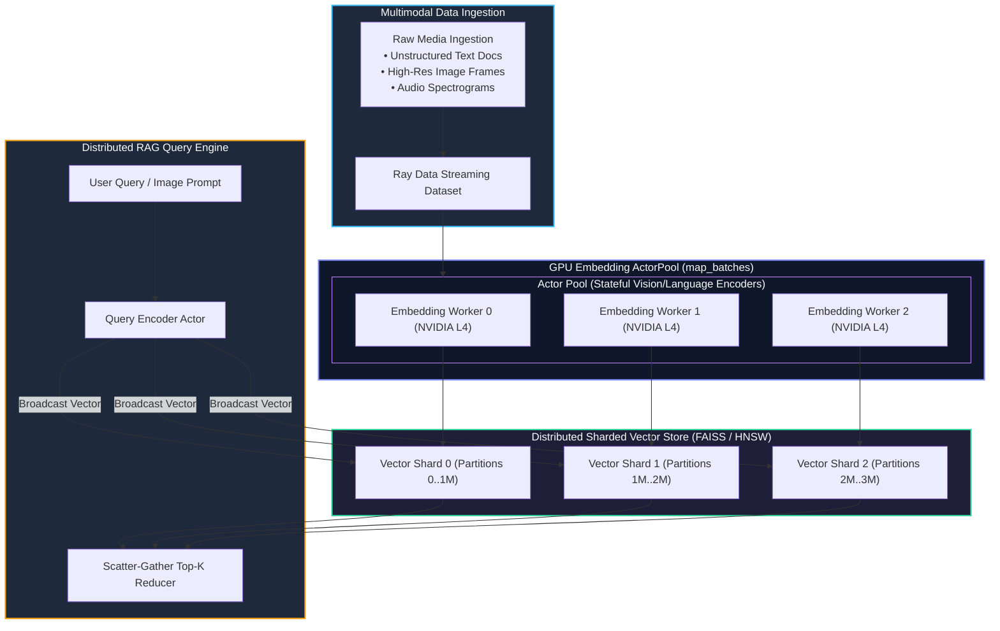
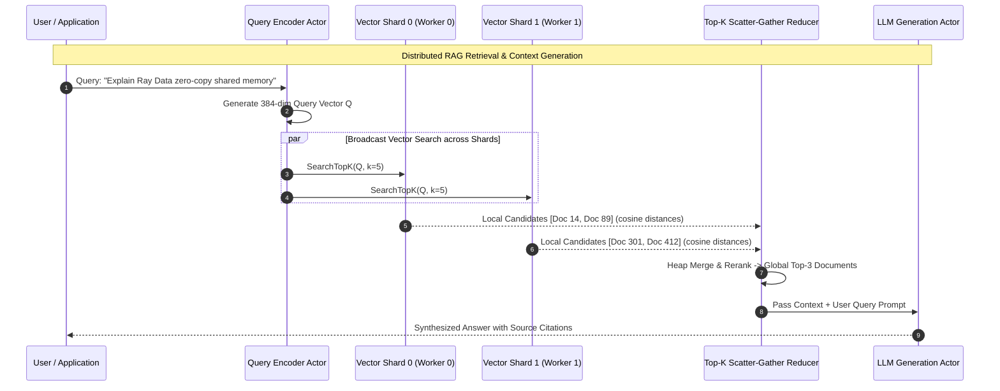

# Chapter 17: Multimodal Embeddings & Distributed Vector RAG

<div class="grid cards" markdown>

-   :material-school: **Topic Focus** &bull; Ray Data for GenAI, Distributed Embedding Generation, Vector Search, and Multimodal RAG
-   :material-play-circle: **Interactive Challenges** &bull; 4 Hands-on Exercises
-   :material-rocket-launch: [**Launch Playground in Wasm →**](../playground/index.html?chapter=17){ .md-button .md-button--primary }

</div>

---

## 1. Architectural Overview & Control Plane Mechanics

Scaling Retrieval-Augmented Generation (RAG) to billions of documents requires distributed embedding extraction and parallel vector index partitioning. Using **Ray Data**, documents and multimodal media (images, audio, text) are processed in parallel across actor pools.





The transformed vector embeddings are indexed across partitioned memory nodes, enabling sub-10ms top-K nearest neighbor retrieval at enterprise scale.

---

## 2. Annotated Python Code Anatomy & API Reference

```python
import ray
import numpy as np

# 1. Define stateful embedding model actor
class EmbeddingWorker:
    def __init__(self):
        # In real systems: from sentence_transformers import SentenceTransformer
        self.dim = 384

    def __call__(self, batch: dict) -> dict:
        texts = batch["text"]
        # Generate normalized dense embeddings
        embeddings = np.random.randn(len(texts), self.dim).astype(np.float32)
        embeddings /= np.linalg.norm(embeddings, axis=1, keepdims=True)
        return {"text": texts, "embeddings": embeddings}

# 2. Stream dataset through embedding actor pool
ds = ray.data.from_items([{"text": f"Document chunk {i}"} for i in range(100)])
embedded_ds = ds.map_batches(
    EmbeddingWorker,
    compute=ray.data.ActorPoolStrategy(min_size=2, max_size=4),
    batch_size=32
)
```

---

## 3. Production Best Practices & Hardening Guidelines

1. **Use `ActorPoolStrategy` in `map_batches`**: Avoid reloading heavy embedding model weights per batch by maintaining persistent worker actors.
2. **Normalize Vector Embeddings**: Normalize embeddings (`L2` norm = 1.0) so cosine similarity can be computed via high-speed dot products.
3. **Partition Vector Indices by Shard**: Shard large vector databases across nodes to parallelize top-K search queries.
4. **Tune Batch Sizes for Tensor Cores**: Align embedding batch sizes to multiples of 8 or 16 (e.g. 32, 64, 128) to maximize GPU Tensor Core utilization.
5. **Stream Direct to Storage / Vector DBs**: Write embedded chunks directly to cloud object stores or vector databases without staging on the driver.

---

## 4. Troubleshooting & Diagnostic Workflows

1. **Embedding Pipeline Memory Leaks**:
   - *Symptom*: Actor workers crash with OOM after processing thousands of batches.
   - *Fix*: Call `torch.cuda.empty_cache()` periodically inside the embedding actor's `__call__` method.
2. **Slow Embedding Throughput**:
   - *Symptom*: Low GPU utilization during embedding generation.
   - *Fix*: Increase `batch_size` in `map_batches` and prefetch input data chunks.
3. **Uneven Index Shards**:
   - *Symptom*: One vector search worker takes 10x longer than peers during query execution.
   - *Fix*: Repartition datasets uniformly before embedding generation with `ds.repartition()`.

---

## 5. Hands-on Practice Exercises

| Exercise ID | Goal / Topic | Playground Link |
| :--- | :--- | :--- |
| `data_genai01` | Streaming Multimodal Image & Audio ETL | [**Open Exercise data_genai01 →**](../playground/index.html?exercise=data_genai01) |
| `data_genai02` | Accelerated Batch Embeddings with ActorPoolStrategy | [**Open Exercise data_genai02 →**](../playground/index.html?exercise=data_genai02) |
| `data_genai03` | Dynamic Token Length Bucketing & Padding Optimization | [**Open Exercise data_genai03 →**](../playground/index.html?exercise=data_genai03) |
| `data_genai04` | Streaming Parallel Ingestion into Vector Databases | [**Open Exercise data_genai04 →**](../playground/index.html?exercise=data_genai04) |
