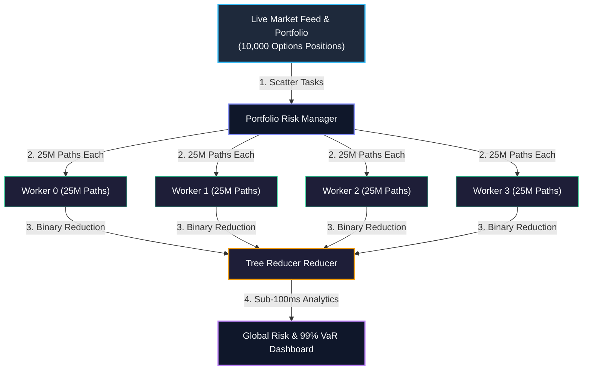

# Chapter 18: Quantitative Finance Modeling & Monte Carlo Risk Engines

<div class="grid cards" markdown>

-   :material-school: **Topic Focus** &bull; Distributed Monte Carlo, Black-Scholes Option Pricing, Portfolio Value at Risk (VaR), and Risk Engines
-   :material-play-circle: **Interactive Challenges** &bull; 3 Hands-on Exercises
-   :material-rocket-launch: [**Launch Playground in Wasm →**](../playground/index.html?chapter=18){ .md-button .md-button--primary }

</div>

---

## 1. Architectural Overview & Control Plane Mechanics

Quantitative finance models—such as multi-asset Monte Carlo path simulations, Value at Risk (VaR) estimations, and high-frequency risk analytics—are embarrassingly parallel and computationally intensive.



> **Diagram Walkthrough & Core Concepts:**
> - **Embarrassingly Parallel Monte Carlo**: Simulation tasks evaluate hundreds of millions of asset pricing paths simultaneously across CPU/GPU cluster nodes.
> - **Hierarchical Tree Aggregation**: Individual worker distributions and Greeks are merged through multi-level binary reduction stages in Plasma shared memory, avoiding driver bottlenecking.
> - **Sub-100ms Real-Time VaR**: High-throughput vectorized matrix execution enables near-instantaneous recalculation of Value at Risk (VaR) and Expected Shortfall during live market shocks.

---

## 2. Annotated Python Code Anatomy & API Reference

```python
import ray
import numpy as np

# 1. Distributed Monte Carlo simulation worker
@ray.remote
def simulate_black_scholes_paths(
    s0: float, k: float, r: float, sigma: float, t: float, num_paths: int
) -> dict:
    """Simulates Geometric Brownian Motion paths and calculates European call payoff."""
    dt = t
    z = np.random.standard_normal(num_paths)
    st = s0 * np.exp((r - 0.5 * sigma ** 2) * dt + sigma * np.sqrt(dt) * z)
    payoffs = np.maximum(st - k, 0)
    discounted_payoff = np.exp(-r * t) * payoffs
    
    return {
        "price": float(np.mean(discounted_payoff)),
        "std_err": float(np.std(discounted_payoff) / np.sqrt(num_paths)),
        "p99_loss": float(np.percentile(discounted_payoff, 1))
    }

# 2. Launch 10M path simulation across cluster workers
futures = [
    simulate_black_scholes_paths.remote(
        s0=100.0, k=105.0, r=0.05, sigma=0.2, t=1.0, num_paths=1_000_000
    )
    for _ in range(10)
]

results = ray.get(futures)
average_price = np.mean([r["price"] for r in results])
print(f"Distributed 10M Path Call Price: {average_price:.4f}")
```

---

## 3. Production Best Practices & Hardening Guidelines

1. **Vectorize Path Generation with NumPy / CuPy**: Use vectorized matrix operations instead of nested Python loops inside worker tasks.
2. **Seed Workers Independently**: Ensure each simulation worker receives a distinct random seed (`np.random.seed(seed + rank)`) to prevent correlated trajectories.
3. **Chunk Simulations into Balanced Batches**: Size simulation chunks between 500,000 and 5,000,000 paths per task to optimize CPU cache utilization.
4. **Aggregate Quantiles with Streaming Sketches**: For large Value at Risk calculations, use t-digest or streaming quantile sketches to avoid moving all raw paths to the driver.
5. **Pre-Allocate Zero-Copy Memory Buffers**: Allocate output arrays directly in Plasma shared memory when passing simulated paths to downstream pricing models.

---

## 4. Troubleshooting & Diagnostic Workflows

1. **Pseudo-Random Number Generator (PRNG) Correlation**:
   - *Symptom*: Monte Carlo variance is artificially low across runs.
   - *Fix*: Use `numpy.random.SeedSequence` to spawn cryptographically independent PRNG streams for all workers.
2. **Memory Exhaustion on Large Path Matrices**:
   - *Symptom*: Workers crash with OOM when storing 50 million price paths in RAM.
   - *Fix*: Compute payoffs and summary statistics within the worker and discard raw path trajectories before returning.
3. **Unequal Worker Execution Times**:
   - *Symptom*: Straggler tasks delay overall portfolio risk reports.
   - *Fix*: Balance path batch sizes uniformly across worker CPUs.

---

## 5. Hands-on Practice Exercises

| Exercise ID | Goal / Topic | Playground Link |
| :--- | :--- | :--- |
| `finance01` | Distributed Monte Carlo Option Pricing | [**Open Exercise finance01 →**](../playground/index.html?exercise=finance01) |
| `finance02` | Portfolio VaR & CVaR Risk Simulation | [**Open Exercise finance02 →**](../playground/index.html?exercise=finance02) |
| `finance03` | Streaming Market Tick Analytics & Rolling VWAP | [**Open Exercise finance03 →**](../playground/index.html?exercise=finance03) |
