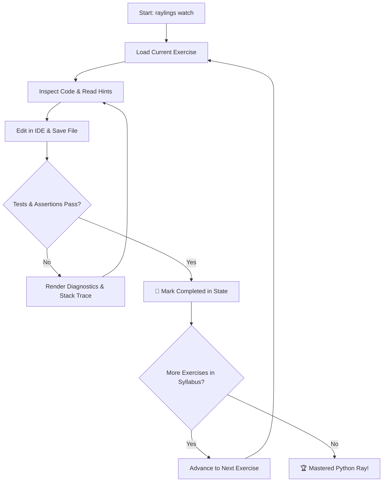

# Raylings ⚡

[](https://dnf0.github.io/raylings/playground/)
[](https://dnf0.github.io/raylings/)
[](https://github.com/dnf0/raylings/actions)
[](https://github.com/dnf0/raylings/actions)
[](https://opensource.org/licenses/Apache-2.0)

**Raylings** is an interactive, hands-on CLI learning environment for [Python Ray](https://www.ray.io/), inspired by [Rustlings](https://github.com/rust-lang/rustlings) and [Ziglings](https://codeberg.org/ziglings/exercises). It guides you through the distributed systems landscape—from foundational `@ray.remote` tasks and stateful actors to high-throughput Ray Data streaming, distributed PyTorch training with Ray Train, scalable model serving with Ray Serve, production Kubernetes orchestration with KubeRay, vLLM tensor parallelism, and pluggable financial modeling packs.

> ⚡ **Try it now in your browser!** No installation required: [**Interactive WebAssembly Playground**](playground.md) ([⚡ Try in Browser](https://dnf0.github.io/raylings/playground/)).

<p align="center">
  
</p>

---

## 🎯 The Raylings Philosophy

Distributed computing can feel daunting with abstract concepts like actor handles, Plasma object store zero-copy buffers, placement group gang-scheduling, and distributed all-reduce topologies.

Raylings takes a **guided, test-driven micro-learning** approach:

1. **Active Debugging & Iteration**: You are presented with small, focused Python exercises that contain intentional bugs, incomplete implementations, or anti-patterns, accompanied by `# TODO:` directives and `# WHY:` architectural explanations.
2. **Instant Feedback Loop & Interactive Hotkeys**: The live watcher monitors your filesystem, automatically running tests whenever you save (< 50ms).
3. **Dual-Mode Learning (Offline WASM & Live Cluster)**:
   - **Offline WASM Mode**: Zero cluster setup required. The pure-Python WebAssembly simulator validates tasks, actors, object store references, and dataset transformations directly in-memory or in your browser.
   - **Live Cluster Mode**: Seamlessly connect to a local Ray session, remote Ray cluster, or multi-node Kubernetes `KubeRay` cluster (`ray://localhost:10001`). Exercises provision real actors and verify distributed execution across nodes.
4. **Progressive Hints**: When stuck, multi-tiered hints (`raylings hint <exercise>`) nudge you in the right direction without spoiling the answer.

---

## 🚀 Key Features

<div class="grid cards" markdown>

-   :material-book-open-page-variant:{ .lg .middle } **18 Comprehensive Chapters**

    ---

    81 progressive exercises covering Ray Core, Plasma Object Store, Resource Scheduling, Fault Tolerance, Ray Data, ML from Scratch, Ray Train, Ray Tune, Ray Serve, Observability, KubeRay, vLLM/LLMs, DeepSpeed/FSDP, Multimodal Vectors, and Quant Finance.

    [:octicons-arrow-right-24: Explore Curriculum](syllabus.md)

-   :material-web:{ .lg .middle } **Zero-Install WASM Playground**

    ---

    Run Python 3.12, Monaco Editor, and in-memory Ray simulation 100% client-side inside your web browser via Pyodide WebAssembly.

    [:octicons-arrow-right-24: Launch Playground](playground.md)

-   :material-eye-refresh:{ .lg .middle } **Zero-Friction Live Watcher**

    ---

    Real-time file monitoring with interactive keyboard shortcuts (`[n]` next, `[p]` previous, `[r]` rerun, `[h]` hints, `[q]` quit). Never context-switch away from your terminal or editor.

    [:octicons-arrow-right-24: Watcher Guide](onboarding-guide.md#step-4-interactive-watcher-keystroke-controls)

-   :material-lightning-bolt:{ .lg .middle } **Warm Daemon Engine**

    ---

    Background persistent Ray session eliminates startup and GCS initialization latency between exercise iterations, providing instant feedback in sub-second test cycles.

    [:octicons-arrow-right-24: Daemon Details](cli-reference.md#raylings-daemon)

-   :material-compass:{ .lg .middle } **Interactive Guided Tour**

    ---

    A 5-step onboarding experience (`raylings tour`) that introduces distributed Ray concepts, verifies system health, and teaches essential keyboard controls.

    [:octicons-arrow-right-24: Start Onboarding](onboarding-guide.md)

-   :material-monitor-dashboard:{ .lg .middle } **Interactive Split-Pane TUI**

    ---

    Full-screen terminal interface (`raylings tui`) featuring curriculum tree navigation, syntax-highlighted code preview, hotkey execution (`[r]`), hint revelation (`[h]`), and telemetry overlays (`[t]`).

    [:octicons-arrow-right-24: TUI Reference](cli-reference.md#raylings-tui)

-   :material-chart-timeline-variant-shimmer:{ .lg .middle } **Real-Time Cluster Telemetry**

    ---

    Live cluster inspector (`raylings top` / `raylings metrics`) monitoring Plasma object store memory, spilling rates, node CPU/GPU saturation, and active actor tables with JSON export.

    [:octicons-arrow-right-24: Telemetry Reference](cli-reference.md#raylings-top-raylings-metrics)

-   :material-puzzle:{ .lg .middle } **Pluggable Curriculum Registry**

    ---

    Extensible plugin architecture (`raylings plugins`) for authoring, distributing, and loading external domain packs (e.g., Chapter 18 Quantitative Finance).

    [:octicons-arrow-right-24: Plugin Architecture](plugins.md)

-   :material-kubernetes:{ .lg .middle } **Cloud & KubeRay Multi-Node**

    ---

    Automated KinD 3-node cluster orchestration (`scripts/kuberay/`) and end-to-end integration test suite verifying remote Ray client execution and DDP across Kubernetes pods.

    [:octicons-arrow-right-24: KubeRay Guide](cloud-kuberay.md)

-   :material-auto-fix:{ .lg .middle } **Exercise Scaffolding CLI**

    ---

    Standardized generator (`raylings new`) to instantly scaffold exercise skeletons, reference solutions, validation harnesses, and manifest registration snippets.

    [:octicons-arrow-right-24: Scaffolder Reference](cli-reference.md#raylings-new-raylings-new-exercise)

-   :material-microsoft-visual-studio-code:{ .lg .middle } **Native VS Code & Cursor Extension**

    ---

    Integrated sidebar curriculum tree view, auto-run on save, status bar cluster health indicators, and command palette integration for VS Code and Cursor.

    [:octicons-arrow-right-24: IDE Setup](onboarding-guide.md#vs-code-native-extension)

-   :material-stethoscope:{ .lg .middle } **Preflight System Doctor**

    ---

    5-point diagnostic suite (`raylings doctor`) verifying Python 3.10+, Ray runtime, cluster health, CPU/RAM resource limits, and exercise manifests.

    [:octicons-arrow-right-24: Doctor Checks](onboarding-guide.md#preflight-diagnostics-raylings-doctor)

</div>

---

## 🔄 The Raylings Learning Loop



---

## 🏗️ System Architecture

```
                                  +-----------------------+
                                  |     User Terminal     |
                                  +-----------+-----------+
                                              |
                                              v
                                  +-----------------------+
                                  |   Raylings CLI (Typer)|
                                  +-----------+-----------+
                                              |
                     +------------------------+------------------------+
                     |                                                 |
                     v                                                 v
         +-----------------------+                         +-----------------------+
         |  File Watcher Engine  |                         | Rich UI & TUI Engine  |
         |      (watchfiles)     |                         |  (split-pane / top)   |
         +-----------+-----------+                         +-----------------------+
                     |
                     v
         +-----------------------+
         |  Curriculum Manifest  |  (18 Chapters / 81 Exercises)
         +-----------+-----------+
                     |
                     v
         +-----------------------+
         |   Exercise Runner     |
         +-----------+-----------+
                     |
        +------------+------------+
        |                         |
        v                         v
+----------------+       +-------------------+
| Pure-Python    |       | Live Ray Cluster  |
| In-Memory WASM |  OR   | & KubeRay Multi-  |
| Ray Simulator  |       | Node Adapter      |
+----------------+       +-------------------+
```

---

## ⚡ Quick Navigation

- [**Getting Started**](getting-started.md) — Prerequisites, installation (`uv` / `pip`), and your first 5 minutes.
- [**Interactive Playground**](playground.md) — WebAssembly-powered Monaco editor learning in the browser.
- [**Onboarding Guide**](onboarding-guide.md) — Guided tour, doctor diagnostics, and VS Code integration.
- [**Curriculum Syllabus**](syllabus.md) — Detailed breakdown of all 18 chapters and 81 exercises.
- [**Plugin Architecture**](plugins.md) — Extensible domain packs and custom curriculum authoring.
- [**Cloud & KubeRay Guide**](cloud-kuberay.md) — Multi-node KinD testing, remote execution, and Helm deployment.
- [**CLI Reference**](cli-reference.md) — Comprehensive reference manual for all commands and options.
- [**Troubleshooting**](troubleshooting.md) — Solutions for port conflicts, memory spilling, and DDP deadlocks.
- [**Contributing**](contributing.md) — How to author new exercises and contribute to Raylings.
