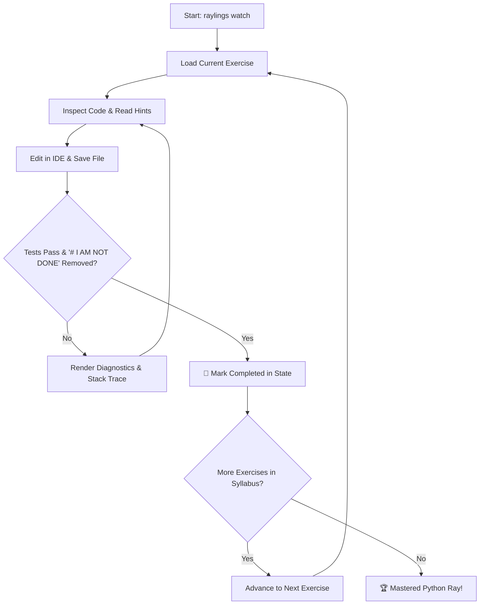
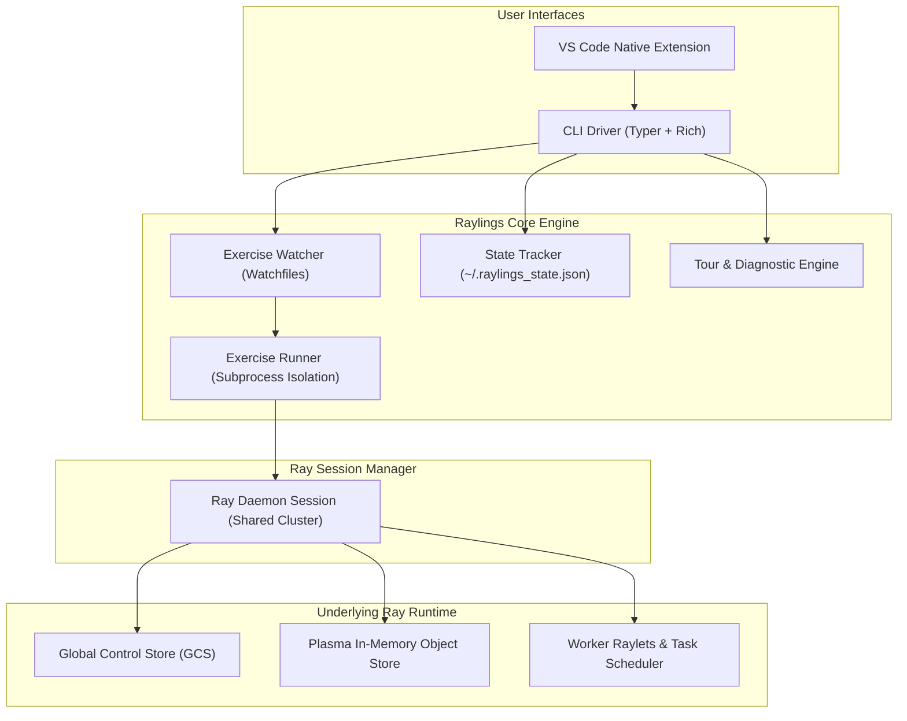

# Raylings ⚡

**Raylings** is an interactive, hands-on CLI learning environment for [Python Ray](https://www.ray.io/), inspired by [Rustlings](https://github.com/rust-lang/rustlings). It guides you through the distributed systems landscape—from foundational `@ray.remote` tasks and stateful actors to high-throughput Ray Data streaming, distributed PyTorch training with Ray Train, scalable model serving with Ray Serve, and production Kubernetes orchestration with KubeRay.

---

## 🎯 The Raylings Philosophy

Distributed computing can feel daunting with abstract concepts like actor handles, Plasma object store zero-copy buffers, placement group gang-scheduling, and distributed all-reduce topologies.

Raylings takes a **learn-by-fixing** approach:

1. You are presented with small, focused Python exercises that contain intentional bugs, incomplete implementations, or anti-patterns.
2. The live watcher monitors your filesystem, automatically running tests whenever you save.
3. You edit the exercise, fix the bug or implement the distributed primitive, remove the `# I AM NOT DONE` marker, and save.
4. Raylings instantly verifies your solution and advances you to the next topic.

---

## 🚀 Key Features

-   :material-book-open-page-variant:{ .lg .middle } **14 Comprehensive Chapters**

    ---

    66 progressive exercises covering Ray Core, Plasma Object Store, Resource Scheduling, Fault Tolerance, Ray Data, ML from Scratch, Ray Train, Ray Tune, Ray Serve, Observability, and KubeRay.

    [:octicons-arrow-right-24: Explore Curriculum](syllabus.md)

-   :material-eye-refresh:{ .lg .middle } **Zero-Friction Live Watcher**

    ---

    Real-time file monitoring with interactive keyboard shortcuts (`[n]` next, `[p]` previous, `[r]` rerun, `[h]` hints, `[q]` quit). Never context-switch away from your terminal or editor.

    [:octicons-arrow-right-24: Watcher Guide](onboarding-guide.md#step-4-interactive-watcher-keystroke-controls)

-   :material-lightning-bolt:{ .lg .middle } **Warm Daemon Engine**

    ---

    Background persistent Ray session eliminates startup and GCS initialization latency between exercise iterations, providing instant feedback in sub-second test cycles.

    [:octicons-arrow-right-24: Daemon Details](cli-reference.md#raylings-daemon)

-   :material-compass:{ .lg .middle } **Interactive Guided Tour**

    ---

    A 5-step onboarding experience (`raylings tour`) that introduces distributed Ray concepts, verifies system health, and teaches essential keyboard controls.

    [:octicons-arrow-right-24: Start Onboarding](onboarding-guide.md)

-   :material-microsoft-visual-studio-code:{ .lg .middle } **Native VS Code Extension**

    ---

    Integrated sidebar curriculum tree view, auto-run on save, status bar cluster health indicators, and command palette integration for VS Code and Cursor.

    [:octicons-arrow-right-24: IDE Setup](onboarding-guide.md#vs-code-native-extension)

-   :material-stethoscope:{ .lg .middle } **Preflight System Doctor**

    ---

    5-point diagnostic suite (`raylings doctor`) verifying Python 3.10+, Ray runtime, cluster health, CPU/RAM resource limits, and exercise manifests.

    [:octicons-arrow-right-24: Doctor Checks](onboarding-guide.md#preflight-diagnostics-raylings-doctor)

---

## 🔄 The Raylings Learning Loop

---

## 🏗️ System Architecture

Raylings is built with a modular, decoupled architecture consisting of an interactive CLI runtime, a daemon lifecycle manager, a persistent state store, and an extensible IDE bridge.

---

## ⚡ Quick Navigation

Ready to start learning distributed Ray? Pick a destination below:

- [**Getting Started**](getting-started.md) — Prerequisites, installation (`uv` / `pip`), and your first 5 minutes.
- [**Onboarding Guide**](onboarding-guide.md) — Guided tour, doctor diagnostics, and VS Code integration.
- [**Curriculum Syllabus**](syllabus.md) — Detailed breakdown of all 14 chapters and 66 exercises.
- [**CLI Reference**](cli-reference.md) — Comprehensive reference manual for all commands and options.
- [**Troubleshooting**](troubleshooting.md) — Solutions for port conflicts, memory spilling, and DDP deadlocks.
- [**Contributing**](contributing.md) — How to author new exercises and contribute to Raylings.
