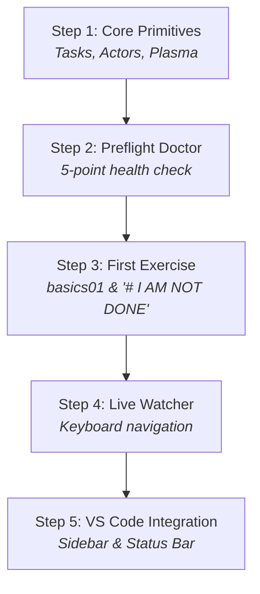
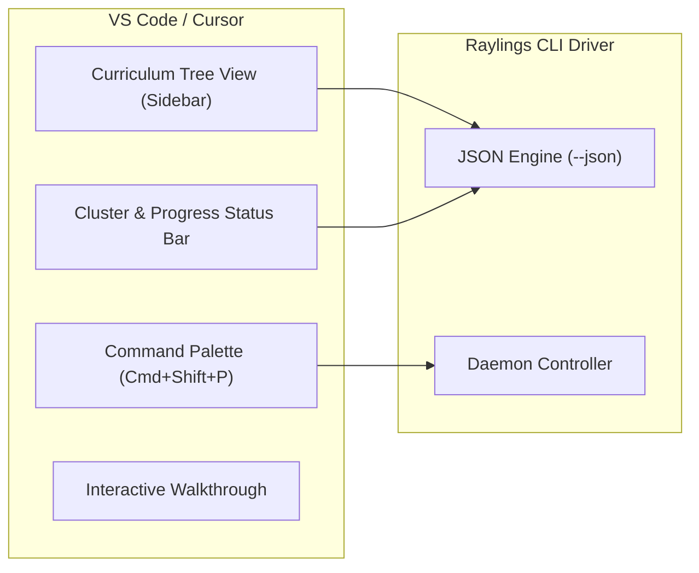

# Interactive Onboarding & Learner Guide 🧭

Raylings provides a rich, multi-tiered onboarding workflow designed to ensure your system is properly configured, familiarise you with distributed concepts, and integrate seamlessly into your favorite IDE.

---

## 🗺️ The 5-Step Guided Tour (`raylings tour`)

Raylings includes an interactive guided tour that introduces you to core distributed computing primitives, exercise mechanics, and CLI productivity workflows.

To start the tour interactively:

```bash
raylings tour
```

You can also run non-interactively in automated setups or CI:

```bash
raylings tour --non-interactive  # or -y
```

Or jump directly to a specific step (1–5):

```bash
raylings tour --step 3
```

For programmatic integrations, extract all tour steps as JSON:

```bash
raylings tour --json
```

---

### Tour Step Breakdown



#### Step 1: Welcome & Distributed Primitives
- **Focus**: What Ray is and how Raylings structures learning.
- **Key Concepts**: [Ray Core](syllabus.md#chapter-1-01_basics-ray-core-foundations), tasks, actors, futures (`ObjectRef`), and the unified AI compute ecosystem.
- **Suggested Command**: `raylings list`

#### Step 2: Environment & Preflight Diagnostics
- **Focus**: Verifying Python 3.10+, Ray runtime, cluster health, and system capacity.
- **Key Concepts**: Automated preflight checks, local cluster detection, daemon management.
- **Suggested Command**: `raylings doctor`

#### Step 3: Solving Your First Exercise (`basics01.py`)
- **Focus**: Understanding the exercise workflow and the `# I AM NOT DONE` marker.
- **Key Concepts**: Decorating functions with `@ray.remote`, asynchronous scheduling with `.remote()`, blocking retrieval with `ray.get()`.
- **Suggested Command**: `raylings run exercises/01_basics/basics01.py`

#### Step 4: Interactive Watcher & Keystroke Controls
- **Focus**: Continuous feedback loop and hotkey navigation.
- **Key Controls**: `[n]` Next, `[p]` Previous, `[r]` Rerun, `[h]` Hint, `[q]` Quit.
- **Suggested Command**: `raylings watch`

#### Step 5: Native VS Code & IDE Experience
- **Focus**: Enhancing productivity with the dedicated VS Code extension.
- **Key Features**: Sidebar curriculum tree, real-time status bar cluster health, auto-run on save.
- **Suggested Command**: `code .`

---

## 🔍 Preflight Diagnostics (`raylings doctor`)

Before working through advanced chapters like Ray Train DDP or KubeRay, ensure your development workstation satisfies all system requirements using `raylings doctor`.

```bash
raylings doctor
```

```text
                     Preflight Diagnostics Summary                     
┏━━━━━━━━━━━━━━━━━━━━━━━━━━━┳━━━━━━━━┳━━━━━━━━━━━━━━━━━━━━━━━━━━━━━━━━┓
┃ Diagnostic Check          ┃ Status ┃ Details                        ┃
┡━━━━━━━━━━━━━━━━━━━━━━━━━━━╇━━━━━━━━╇━━━━━━━━━━━━━━━━━━━━━━━━━━━━━━━━┩
│ Python Version            │ ✓ PASS │ Python 3.12.3 (>= 3.10)        │
│ Ray Installation          │ ✓ PASS │ Ray v2.43.0 installed          │
│ Ray Daemon / Cluster      │ ✓ PASS │ Cluster session active         │
│ Exercises Manifest        │ ✓ PASS │ Found 66 exercises in 14 chap  │
│ System Resources          │ ✓ PASS │ 10 logical CPUs, 32.0 GB RAM   │
└───────────────────────────┴────────┴────────────────────────────────┘

Summary: 5 passed, 0 warnings, 0 failed
```

### The 5 Diagnostic Checks

| Check Name | Target Requirement | Status | Critical? | Troubleshooting Recipe |
| :--- | :--- | :---: | :---: | :--- |
| **Python Version** | Python `>= 3.10` | `PASS` / `FAIL` | **Yes** | Upgrade Python via `uv python install 3.12` or `pyenv`. |
| **Ray Installation** | `ray` importable and healthy | `PASS` / `FAIL` | **Yes** | Run `uv pip install ray[default]` or `pip install ray`. |
| **Ray Daemon / Cluster** | Background cluster reachable | `PASS` / `WARN` | No | Auto-starts during exercises, or run `raylings daemon start`. |
| **Exercises Manifest** | `exercises/` populated with 66 files | `PASS` / `WARN` | No | Run `raylings init` to extract bundled exercises. |
| **System Resources** | Minimum 2 CPUs and >= 4GB RAM | `PASS` / `WARN` | No | Warning shown if running on single-core containers. |

### JSON Diagnostic Payloads

Integrate health checks into CI pipelines or editor status badges with `--json`:

```bash
raylings doctor --json
```

```json
{
  "status": "healthy",
  "passed": true,
  "summary": {
    "total": 5,
    "passed": 5,
    "warnings": 0,
    "failed": 0
  },
  "checks": [
    {
      "name": "Python Version",
      "status": "pass",
      "critical": true,
      "details": "Python 3.12.3 (>= 3.10 supported)"
    },
    {
      "name": "Ray Installation",
      "status": "pass",
      "critical": true,
      "details": "Ray v2.43.0 installed and importable"
    }
  ]
}
```

---

## 💻 VS Code Native Extension

Raylings provides a first-class editor extension located in `editors/vscode` that turns VS Code or Cursor into a dedicated Ray learning IDE.



### Key Extension Features

1. **Curriculum Explorer Tree View**:
   - Displays all 14 chapters in an expandable sidebar view.
   - Distinct icons for completed (`✓`), pending (`○`), and active (`►`) exercises.
   - Click any exercise to open it immediately in the editor.

2. **Status Bar Cluster & Progress Monitor**:
   - Shows live cluster status (e.g. `$(zap) Ray: 4 Nodes | 12/66 Done`).
   - Click to open the Ray Dashboard or trigger preflight diagnostics.

3. **Auto-Run on File Save**:
   - Automatically invokes `raylings run` on the active exercise when saved.
   - In-editor diagnostic output and inline problem highlighting.

4. **Progressive Hint Peek**:
   - Reveal hints directly in the editor using the `Raylings: Show Hint` command without switching to a terminal window.

### Command Palette Integration

Open the Command Palette (`Ctrl+Shift+P` / `Cmd+Shift+P`) and type `Raylings`:

- `Raylings: Open Interactive Tour` — Launch the built-in walkthrough (`raylings.welcome`).
- `Raylings: Start Watcher` — Open an integrated terminal with `raylings watch`.
- `Raylings: Run Active Exercise` — Execute current file with `raylings run`.
- `Raylings: Show Hint for Current Exercise` — Display progressive hint level.
- `Raylings: Run Preflight Diagnostics` — Execute `raylings doctor`.
- `Raylings: Start / Stop Ray Daemon` — Manage background cluster session.

---

## 💾 Progress Tracking & State Management

Raylings tracks your completion progress using a lightweight JSON state file located at `.raylings_state.json` in your workspace root.

### How State is Updated

1. When you run an exercise via `raylings watch` or `raylings run`:
   - Raylings inspects the file for the `# I AM NOT DONE` marker.
   - It executes the Python script in an isolated subprocess.
   - If the script exits with status code `0` **AND** no `# I AM NOT DONE` marker is found, the exercise is marked as completed.
2. The state tracker writes the result to `.raylings_state.json`:

```json
{
  "basics01": true,
  "basics02": true,
  "basics03": false
}
```

### Inspecting Your Progress

View overall completion statistics and your current active exercise:

```bash
raylings progress
```

Output:

```text
Progress: [====================>                    ] 33.3% (22/66 completed)
Current Exercise: exercises/05_fault_tolerance/fault01.py
```

Or query in machine-readable JSON:

```bash
raylings progress --json
```

```json
{
  "total": 66,
  "completed": 22,
  "percentage": 33.3,
  "current_exercise": "fault01",
  "current_path": "exercises/05_fault_tolerance/fault01.py",
  "is_finished": false
}
```

!!! tip "Resetting Progress"
    To reset your progress and start over, simply delete `.raylings_state.json` or re-add the `# I AM NOT DONE` marker to your exercise files.
